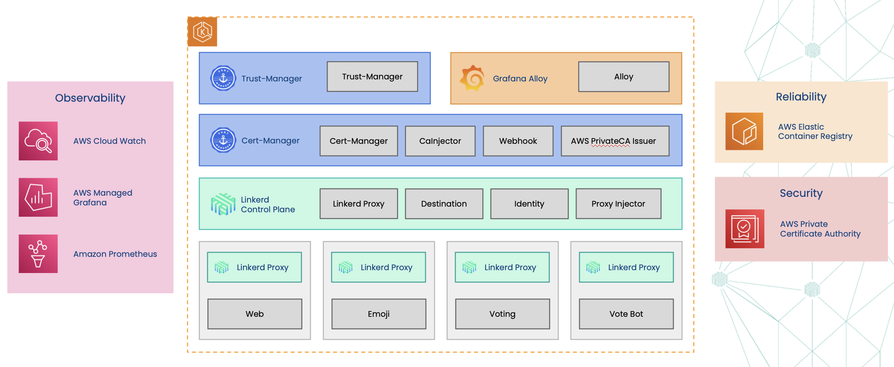

# sma-aws

Service Mesh Academy repo for running Linkerd on AWS.

## Overview

This project provisions a complete AWS infrastructure for running [Linkerd Enterprise](https://linkerd.io/) on [Amazon EKS](https://aws.amazon.com/eks/) using Terraform. It sets up an EKS cluster with networking, monitoring, container registry, and a fully automated certificate management pipeline using AWS Private CA, cert-manager, and trust-manager.

## Architecture



The infrastructure includes:

- **Amazon EKS** — Managed Kubernetes cluster (`t3.medium` nodes, autoscaling 1-5)
- **Amazon VPC** — Custom networking with two public subnets across `ap-northeast-2a` and `ap-northeast-2b`
- **Amazon ECR** — Container registry with image scanning and lifecycle policies
- **Amazon CloudWatch** — Cluster and application log groups (30-day retention)
- **Amazon Managed Prometheus** — Metrics collection with remote write support
- **Amazon Managed Grafana** — Dashboard visualization with SAML authentication and programmatic dashboard provisioning
- **AWS Private CA** — Two-tier PKI hierarchy (root + subordinate CA) for Linkerd mTLS
- **IAM & OIDC** — Scoped roles for EKS, CloudWatch, Prometheus, and AWS PCA issuer via IRSA
- **cert-manager** — Automated certificate lifecycle management with the AWS PCA issuer plugin
- **trust-manager** — Distributes CA trust bundles across namespaces
- **Linkerd Enterprise** — Service mesh with external CA integration for automatic mTLS
- **Grafana Alloy** — Telemetry agent collecting Linkerd metrics to AMP and logs to CloudWatch
- **Grafana Dashboards** — Linkerd dashboards provisioned via API key before SAML setup
- **emojivoto** — Linkerd demo application (Web, Emoji, Voting, Vote Bot) for validating the mesh

## Certificate Management

### PKI Hierarchy

| Layer | Common Name | Validity | AWS PCA Template |
|---|---|---|---|
| Root CA | `root.linkerd.cluster.local` | 10 years | `RootCACertificate/V1` |
| Subordinate CA | `identity.linkerd.cluster.local` | 3 years | `SubordinateCACertificate_PathLen1/V1` |

### How It Works

1. **AWS PCA** hosts the root and subordinate certificate authorities
2. **cert-manager** uses `AWSPCAClusterIssuer` resources to request certificates from AWS PCA via IRSA
3. Issued certificates are stored as Kubernetes Secrets (`linkerd-trust-anchor`, `linkerd-identity-issuer`)
4. **trust-manager** watches the trust anchor Secret and syncs `ca.crt` into a ConfigMap in the `linkerd` namespace
5. **Linkerd** consumes both the identity issuer Secret and the trust roots ConfigMap for mTLS

### Certificate Renewal

cert-manager automatically renews certificates before expiry. The renewal timeline is based on the **actual validity** set by AWS PCA (not the requested `duration` in the Certificate spec, which AWS PCA may override).

To force a manual renewal for testing:

```bash
kubectl cert-manager renew linkerd-identity-issuer -n linkerd
```

To validate a renewal occurred:

```bash
# Check revision incremented
kubectl get certificate linkerd-identity-issuer -n linkerd -o jsonpath='{.status.revision}'

# Check events
kubectl events -n linkerd --for certificate/linkerd-identity-issuer

# Verify trust-manager propagated the update
kubectl get configmap linkerd-identity-trust-roots -n linkerd -o jsonpath='{.metadata.resourceVersion}'
```

## Observability

### Data Flow

```
Linkerd proxies & control plane
    │
    ▼
Grafana Alloy (in-cluster agent)
    ├── Metrics ──▶ Amazon Managed Prometheus (SigV4 remote write)
    └── Logs ────▶ CloudWatch Logs (OTLP via SigV4)
                      ├── /aws/sma/emojivoto  (app logs only, linkerd-proxy filtered out)
                      └── /aws/sma/linkerd    (control plane + proxy sidecar logs)

Amazon Managed Grafana
    ├── Queries AMP via grafana-amazonprometheus-datasource
    └── Pre-provisioned dashboards (no SAML login required)
```

### Auto-Provisioned Dashboards

The `grafana/dashboard` module uses an `aws_grafana_workspace_api_key` to provision four Linkerd dashboards from [grafana.com](https://grafana.com) before SAML authentication is configured:

| Dashboard | Grafana ID |
|---|---|
| Linkerd Deployment | 15475 |
| Linkerd Namespace | 15478 |
| Linkerd Service | 15480 |
| Linkerd Authority | 15482 |

An Amazon Managed Prometheus data source is also created automatically as the backend for these dashboards.

### Grafana SAML Setup (Azure AD)

After `terraform apply`, the SAML outputs provide the values needed to configure Azure AD SSO. Terraform also outputs these as `grafana_saml_setup_instructions`.

1. In **Azure Portal**, go to Microsoft Entra > Enterprise applications > New Application
2. Search for **Amazon Managed Grafana** and create it
3. Select the application > **Single Sign-on** > SAML
4. In **Basic SAML Configuration**, set:
   - **Identifier (Entity ID):** `terraform output grafana_service_provider_identifier_url`
   - **Reply URL (ACS):** `terraform output grafana_service_provider_reply_url`
   - **Sign on URL:** `terraform output grafana_sign_on_url`
5. In **Attributes & Claims**, add a claim:
   - Claim Name: `grafana_role`
   - Source attribute: `user.displayname`
6. In **AWS Console**, open the Grafana workspace > Authentication > SAML configuration:
   - **Metadata URL:** `https://login.microsoftonline.com/TENANT_ID/federationmetadata/2007-06/federationmetadata.xml?appid=APP_ID`
   - **Assertion attribute role:** `grafana_role`
   - **Admin role values:** Username (i.e `Admin`)

## Tools

| Tool | Description | Helm Chart |
|---|---|---|
| [Buoyant Enterprise for Linkerd](https://docs.buoyant.io/buoyant-enterprise-linkerd/latest/overview/) | Service mesh providing automatic mTLS, traffic observability, and reliability features for Kubernetes workloads | `linkerd-enterprise-crds` / `linkerd-enterprise-control-plane` v2.19.4 from `helm.buoyant.cloud` |
| [cert-manager](https://cert-manager.io/) | X.509 certificate lifecycle manager for Kubernetes, handles automatic issuance and renewal | `cert-manager` from `charts.jetstack.io` |
| [AWS PCA Issuer](https://github.com/cert-manager/aws-privateca-issuer) | cert-manager plugin that issues certificates from AWS Private Certificate Authority | `aws-privateca-issuer` from `cert-manager.github.io/aws-privateca-issuer` |
| [trust-manager](https://cert-manager.io/docs/trust/trust-manager/) | Distributes trusted CA bundles across namespaces as ConfigMaps for workload consumption | `trust-manager` from `charts.jetstack.io` |
| [Grafana Alloy](https://grafana.com/oss/alloy/) | OpenTelemetry-compatible telemetry collector that scrapes Linkerd metrics and tails pod logs | `alloy` from `grafana.github.io/helm-charts` |
| [Grafana](https://grafana.com/) | Dashboarding and visualization platform, deployed as Amazon Managed Grafana with SAML SSO | Managed service (AWS) + `grafana/grafana` Terraform provider |

## Prerequisites

- [Terraform](https://www.terraform.io/downloads) >= 1.0
- [AWS CLI](https://aws.amazon.com/cli/) configured with a `buoyant` profile
- [Crane](https://github.com/google/go-containerregistry/blob/main/cmd/crane/README.md)
- A Buoyant Enterprise for Linkerd license key
- Sufficient AWS permissions to create EKS, VPC, IAM, ECR, CloudWatch, Prometheus, and ACM PCA resources

## Project Structure

```
terraform/
├── main.tf                    # Root module orchestration
├── locals.tf                  # Local variables (cluster name, CIDRs)
├── providers.tf               # Provider configuration (AWS, Kubernetes, Helm, Grafana, TLS)
├── variables.tf               # Input variables
├── outputs.tf                 # Output values
├── aws/                       # AWS infrastructure module
│   ├── eks.tf                 # EKS cluster and node group
│   ├── network.tf             # VPC, subnets, internet gateway, routing
│   ├── security_groups.tf     # Security groups and rules
│   ├── iam.tf                 # IAM roles, policies, and OIDC provider
│   ├── pca.tf                 # AWS Private CA (root + subordinate)
│   ├── cloud_watch.tf         # CloudWatch log groups and agent config
│   ├── prometheus.tf          # Amazon Managed Prometheus workspace
│   ├── grafana.tf             # Amazon Managed Grafana workspace and API key
│   ├── erc.tf                 # ECR repository and lifecycle policy
│   ├── variables.tf           # Module variables
│   └── outputs.tf             # Module outputs
├── cert_manager/              # cert-manager + AWS PCA issuer module
│   ├── helm.tf                # Helm releases (cert-manager, aws-privateca-issuer)
│   ├── resources.tf           # AWSPCAClusterIssuers and Certificate resources
│   ├── providers.tf           # Provider configuration
│   └── variables.tf           # Module variables (PCA ARNs, IAM role)
├── trust_manager/             # trust-manager module
│   ├── helm.tf                # Helm release (trust-manager)
│   ├── resources.tf           # Bundle resource for CA distribution
│   └── providers.tf           # Provider configuration
├── grafana/                   # Grafana observability modules
│   ├── alloy/                 # Grafana Alloy telemetry agent
│   │   ├── helm.tf            # Helm release (remote chart from Grafana repo)
│   │   ├── config.alloy       # Alloy config (Linkerd metrics → AMP, logs → CloudWatch)
│   │   ├── providers.tf       # Provider requirements
│   │   └── variables.tf       # Module variables (remote write URL, IRSA role, region)
│   └── dashboard/             # Grafana dashboard provisioning (via API key)
│       ├── resources.tf       # AMP data source + Linkerd dashboards from grafana.com
│       ├── providers.tf       # Provider requirements (grafana/grafana)
│       └── variables.tf       # Module variables (endpoint, API key, AMP URL, region)
└── linkerd/                   # Linkerd Enterprise module
    ├── certificates/          # Linkerd namespace + cert-manager Certificates
    │   ├── providers.tf       # Provider configuration
    │   └── resources.tf       # Namespace and Certificate resources
    └── components/            # Linkerd control plane
        ├── helm.tf            # Helm releases (CRDs + control plane)
        ├── providers.tf       # Provider configuration
        └── variables.tf       # Module variables (license, trust anchor PEM)

manifests/                     # Kubernetes manifest templates
├── pca-root-ca-cluster-issuer.yaml.tmpl      # AWSPCAClusterIssuer for root CA
├── pca-cluster-issuer.yaml.tmpl              # AWSPCAClusterIssuer for subordinate CA
├── linkerd-trust-anchor-cert.yaml.tmpl       # Certificate for root CA trust anchor
├── linkerd-identity-issuer-cert.yaml.tmpl    # Certificate for identity issuer (isCA)
└── linkerd-ca-bundle.yaml.tmpl               # trust-manager Bundle
```

### Module Dependency Order

```
aws_infrastructure
    └──▶ cert_manager
             └──▶ linkerd_certs
                      └──▶ trust_manager
                               └──▶ linkerd
                                        └──▶ alloy
                                                 └──▶ grafana_dashboards
```

## Configuration

Key defaults defined in `terraform/locals.tf`:

| Setting | Value |
|---|---|
| Project suffix | `sma` |
| EKS cluster name | `sma-eks-1` |
| AWS region | `ap-northeast-2` (Seoul) |
| VPC CIDR | `10.2.0.0/16` |
| Pod CIDR | `10.240.0.0/12` |
| Service CIDR | `10.16.0.0/12` |
| Node instance type | `t3.medium` |
| Node group size | 3 desired, 1 min, 5 max |

## Usage

1. **Initialize Terraform:**

   ```bash
   cd terraform
   terraform init
   ```

2. **Review the plan:**

   ```bash
   terraform plan \
     -var="kubernetes_version=1.31" \
     -var="project_suffix=sma" \
     -var="linkerd_enterprise_license=<your-license>"
   ```

3. **Apply the infrastructure:**

   ```bash
   terraform apply \
     -var="kubernetes_version=1.31" \
     -var="project_suffix=sma" \
     -var="linkerd_enterprise_license=<your-license>"
   ```

4. **Configure kubectl:**

   ```bash
   aws eks update-kubeconfig \
     --region ap-northeast-2 \
     --name sma-eks-1 \
     --profile buoyant
   ```

5. **Verify the certificate pipeline:**

   ```bash
   # Check issuers are ready
   kubectl get awspcaclusterissuer

   # Check certificates are issued
   kubectl get certificate -A

   # Check trust bundle is distributed
   kubectl get bundle linkerd-identity-trust-roots
   ```

6. **Verify Linkerd:**

   ```bash
   # Run the Linkerd health checks
   linkerd check

   # Verify the control plane pods
   kubectl get pods -n linkerd
   ```

7. **Verify observability:**

   ```bash
   # Check Alloy is running
   kubectl get pods -n alloy

   # Get the Grafana endpoint
   terraform output grafana_endpoint
   ```

## Outputs

| Output | Description |
|---|---|
| `cluster_name` | EKS cluster name |
| `kube_config` | Cluster kubeconfig (sensitive) |
| `ecr_repository_urls` | Map of image name to ECR repository URL |
| `cloudwatch_log_group_eks` | CloudWatch cluster log group |
| `cloudwatch_log_group_application` | CloudWatch application log group |
| `cloudwatch_agent_role_arn` | IAM role ARN for CloudWatch agent |
| `prometheus_workspace_id` | Managed Prometheus workspace ID |
| `prometheus_endpoint` | Prometheus query endpoint |
| `prometheus_remote_write_url` | Prometheus remote write URL |
| `prometheus_role_arn` | IAM role ARN for Prometheus |
| `grafana_service_provider_identifier_url` | SAML Entity ID URL |
| `grafana_service_provider_reply_url` | SAML Assertion Consumer Service URL |
| `grafana_sign_on_url` | SAML sign-on URL |
| `grafana_saml_setup_instructions` | Step-by-step Azure AD SAML setup guide |

## Cleanup

To destroy all provisioned resources:

```bash
cd terraform
terraform destroy
```
