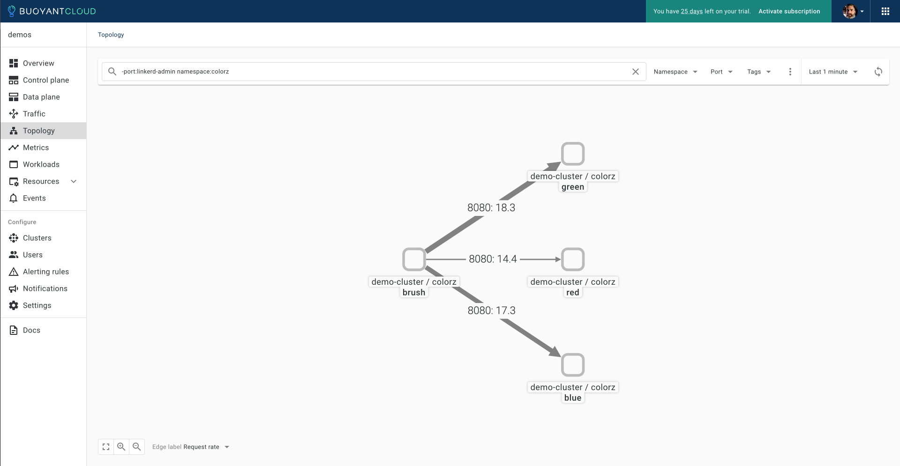
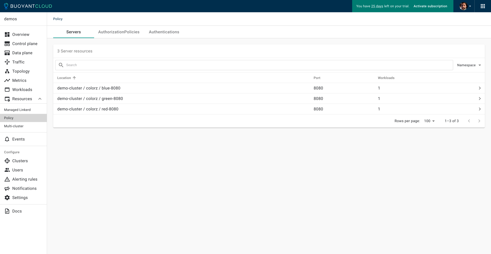

# Deploying Buoyant Enterprise for Linkerd (BEL) With High Availability Zonal Load Balancing (HAZL)

## deploying-bel-with-hazl

### Tom Dean | Jason Morgan | Buoyant

### Last edit: 2/5/2024

## Introduction

In this *hands-on demonstration*, we will deploy **Buoyant Enterprise for Linkerd** and demonstrate how to enable **High Availability Zonal Load Balancing (HAZL)**.  We'll then take a look at how **HAZL** works to keep network traffic *in-zone* where possible, and explore **Security Policy generation**.

### Buoyant Enterprise for Linkerd (BEL)

[Buoyant Enterprise for Linkerd](https://buoyant.io/enterprise-linkerd)

**Buoyant Enterprise for Linkerd** is an enterprise-grade service mesh for Kubernetes. It makes Kubernetes applications **reliable**, **secure**, and **cost-effective** *without requiring any changes to application code*. Buoyant Enterprise for Linkerd contains all the features of open-source Linkerd, the world's fastest, lightest service mesh, plus *additional* enterprise-only features such as:

- High Availability Zonal Load Balancing (HAZL)
- Security Policy Generation
- FIPS-140-2/3 Compliance
- Lifecycle Automation
- Enterprise-Hardened Images
- Software Bills of Materials (SBOMs)
- Strict SLAs Around CVE Remediation

We're going to try out **Security Policy Generation** and **HAZL** in this demo, but remember that we'll get all the **BEL** features, ***except for FIPS***, which isn't included in our Trial license.

### High Availability Zonal Load Balancing (HAZL)

**High Availability Zonal Load Balancing (HAZL)** is a dynamic request-level load balancer in **Buoyant Enterprise for Linkerd** that balances **HTTP** and **gRPC** traffic in environments with **multiple availability zones**. For Kubernetes clusters deployed across multiple zones, **HAZL** can **dramatically reduce cloud spend by minimizing cross-zone traffic**.

Unlike other zone-aware options that use **Topology Hints** (including **Istio** and open source **Linkerd**), **HAZL** *never sacrifices reliability to achieve this cost reduction*.

In **multi-zone** environments, **HAZL** can:

- **Cut cloud spend** by eliminating cross-zone traffic both within and across cluster boundaries;
- **Improve system reliability** by distributing traffic to additional zones as the system comes under stress;
- **Prevent failures before they happen** by quickly reacting to increases in latency before the system begins to fail.
- **Preserve zone affinity for cross-cluster calls**, allowing for cost reduction in multi-cluster environments.

Like **Linkerd** itself, **HAZL** is designed to *"just work"*. It works without operator involvement, can be applied to any Kubernetes service that speaks **HTTP** / **gRPC** regardless of the number of endpoints or distribution of workloads and traffic load across zones, and in the majority of cases *requires no tuning or configuration*.

### How High Availability Zonal Load Balancing (HAZL) Works

For every endpoint, **HAZL** maintains a set of data that includes:

- The **zone** of the endpoint
- The **cost** associated with that zone
- The **recent latency** of responses to that endpoint
- The **recent failure rate** of responses to that endpoint

For every service, **HAZL** continually computes a load metric measuring the utilization of the service. When load to a service falls outside the acceptable range, whether through failures, latency, spikes in traffic, or any other reason, **HAZL** dynamically adds additional endpoints from other zones. When load returns to normal, **HAZL** automatically shrinks the load balancing pool to just in-zone endpoints.

In short: under normal conditions, **HAZL** keeps all traffic within the zone, but when the system is under stress, **HAZL** will temporarily allow cross-zone traffic until the system returns to normal. We'll see this in the **HAZL** demonstration.

**HAZL** will also apply these same principles to cross-cluster / multi-cluster calls: it will preserve zone locality by default, but allow cross-zone traffic if necessary to preserve reliability.

### How High Availability Zonal Load Balancing (HAZL) vs Topology Hints

**HAZL** was designed in response to limitations seen by customers using Kubernetes's native **Topology Hints** (aka **Topology-aware Routing**) mechanism. These limitations are shared by native Kubernetes balancing (**kubeproxy**) as well as systems such as open source **Linkerd** and **Istio** that make use of **Topology Hints** to make routing decisions.

Within these systems, the endpoints for each service are allocated ahead of time to specific zones by the **Topology Hints** mechanism. This distribution is done at the Kubernetes API level, and attempts to allocate endpoints within the same zone (but note this behavior isn't guaranteed, and the Topology Hints mechanism may allocate endpoints from other zones). Once this allocation is done, it is static until endpoints are added or removed. It does not take into account traffic volumes, latency, or service health (except indirectly, if failing endpoints get removed via health checks).

Systems that make use of **Topology Hints**, including **Linkerd** and **Istio**, use this allocation to decide where to send traffic. This accomplishes the goal of keeping traffic within a zone but at the expense of reliability: **Topology Hints** itself provides no mechanism for sending traffic across zones if reliability demands it. The closest approximation in (some of) these systems are manual failover controls that allow the operator to failover traffic to a new zone.

Finally, **Topology Hints** has a set of well-known constraints, including:

- It does not work well for services where a large proportion of traffic originates from a subset of zones.
- It does not take into account tolerations, unready nodes, or nodes that are marked as control plane or master nodes.
- It does not work well with autoscaling. The autoscaler may not respond to increases in traffic, or respond by adding endpoints in other zones.
- No affordance is made for cross-cluster traffic.

These constraints have real-world implications. As one customer put it when trying **Istio** + **Topology Hints**: "What we are seeing in *some* applications is that they won’t scale fast enough or at all (because maybe two or three pods out of 10 are getting the majority of the traffic and is not triggering the HPA) and *can cause a cyclic loop of pods crashing and the service going down*."

### Demonstration: Overview

In this *hands-on demonstration*, we will deploy **Buoyant Enterprise for Linkerd** on a `k3d` Kubernetes cluster and will demonstrate how to quickly enable **High Availability Zonal Load Balancing (HAZL)**.  We'll then take a look at how **HAZL** works to keep network traffic *in-zone* where possible, and explore **Security Policy generation**.

**In this demonstration, we're going to do the following:**

- Deploy a `k3d` Kubernetes cluster
- Deploy **Buoyant Enterprise for Linkerd** with **HAZL** disabled on the cluster
- Deploy the **Colorwheel** application to the cluster, to generate multi-zonal traffic
  - Monitor traffic from the **Colorwheel** application, with **HAZL** disabled
- Enable **High Availability Zonal Load Balancing (HAZL)**
  - Monitor traffic from the **Colorwheel** application, with **HAZL** enabled
  - Observe the effect on cross-az traffic
- Increase the number of requests in the **Colorwheel** application
  - Monitor the increased traffic from the **Colorwheel** application
  - Observe the effect on cross-az traffic
- Decrease the number of requests in the **Colorwheel** application
  - Monitor the decreased traffic from the **Colorwheel** application
  - Observe the effect on cross-az traffic

Feel free to follow along with *your own instance* if you'd like, using the resources and instructions provided in this repository.

### Demo: Prerequisites

**If you'd like to follow along, you're going to need the following:**

- [Docker](https://docs.docker.com/get-docker/)
- [k3d](https://k3d.io)
- [step](https://smallstep.com/docs/step-cli/installation/)
- The `watch` command must be installed and working
- [Buoyant Enterprise for Linkerd License](https://enterprise.buoyant.io/start_trial)
- [The Demo Assets, from GitHub](https://github.com/BuoyantIO/service-mesh-academy/tree/main/deploying-bel-with-hazl)

All prerequisites must be *installed* and *working properly* before proceeding. The instructions in the provided links will get you there. A trial license for Buoyant Enterprise for Linkerd can be obtained from the link above. Instructions on obtaining the demo assets from GitHub are below.

### Demo: Included Scripts

There are three `bel-demo-*` shell scripts provided with the repository, if you'd like to use CLI automation to work through the demonstration.

```bash
Contents of service-mesh-academy/deploying-bel-with-hazl:

.
├── README.md
├── bel-demo-full-repo.sh
├── bel-demo-install.sh
├── bel-demo-hazl-policy.sh
├── certs
├── cluster
├── colorz
└── demo-magic.sh
```

**Available Scripts:**

- `bel-demo-full-repo.sh`
  - Walks through the full repository, all steps demonstrated
- `bel-demo-install.sh`
  - Deploys the k3d cluster for you, walks through **BEL** install, **HAZL** and **policy** demonstration steps
- `bel-demo-hazl-policy.sh`
  - Deploys the k3d cluster and **BEL** without **HAZL** for you, walks through **HAZL** and **policy** demonstration steps

These scripts leverage the `demo-magic.sh` script. There's no need to call `demo-magic.sh` directly.

To execute a script, using the `full-repo` script as an example, use:

```bash
./bel-demo-full-repo.sh
```

For more information, look at the scripts.

### The Colorwheel Application

This repository includes the **Colorwheel** application, which generates traffic across multiple availability zones in our Kubernetes cluster, allowing us to observe the effect that **High Availability Zonal Load Balancing (HAZL)** has on traffic.

## Demo 1: Deploy a Kubernetes Cluster With Buoyant Enterprise for Linkerd, With HAZL Disabled

First, we'll deploy a Kubernetes cluster using `k3d` and deploy Buoyant Enterprise for Linkerd (BEL).

### Task 1: Clone the `deploying-bel-with-hazl` Repository

[GitHub: Deploying Buoyant Enterprise for Linkerd with High Availability Zonal Load Balancing (HAZL)](https://github.com/BuoyantIO/service-mesh-academy/tree/main/deploying-bel-with-hazl)

To get the resources we will be using in this demonstration, you will need to clone a copy of the GitHub `BuoyantIO/service-mesh-academy` repository. We'll be using the materials in the `service-mesh-academy/deploying-bel-with-hazl` subdirectory.

Clone the `BuoyantIO/service-mesh-academy` GitHub repository to your preferred working directory:

```bash
git clone https://github.com/BuoyantIO/service-mesh-academy.git
```

Change directory to the `deploying-bel-with-hazl` subdirectory in the `service-mesh-academy` repository:

```bash
cd service-mesh-academy/deploying-bel-with-hazl
```

Taking a look at the contents of `service-mesh-academy/deploying-bel-with-hazl`:

```bash
ls -la
```

You should see the following:

```bash
total 112
drwxrwxr-x   9 user  staff    288 Feb  3 13:47 .
drwxr-xr-x  23 user  staff    736 Feb  2 13:05 ..
-rw-r--r--   1 user  staff  21495 Feb  3 13:43 README.md
-rwxr-xr-x   1 user  staff   9367 Feb  2 13:37 bel-demo-full-repo.sh
-rwxr-xr-x   1 user  staff  12581 Feb  2 13:37 bel-demo-hazl-policy.sh
-rwxr-xr-x   1 user  staff  12581 Feb  2 13:37 bel-demo-install.sh
drwxr-xr-x   3 user  staff     96 Feb  2 13:14 certs
drwxr-xr-x   3 user  staff     96 Feb  2 13:14 cluster
drwxr-xr-x   9 user  staff    288 Feb  2 13:14 colorz
-rwxr-xr-x   1 user  staff   3963 Feb  2 13:14 demo-magic.sh
```

With the assets in place, we can proceed to creating a cluster with `k3d`.

### Task 2: Deploy a Kubernetes Cluster Using `k3d`

Before we can deploy **Buoyant Enterprise for Linkerd**, we're going to need a Kubernetes cluster. Fortunately, we can use `k3d` for that.  There's a cluster configuration file in the `cluster` directory, that will create a cluster with one control plane and three worker nodes, in three different availability zones.

We can use the following commands to have `k3d` create a cluster with 3 availability zones.

Check for existing `k3d` clusters:

```bash
k3d cluster list
```

If you'd like to *delete* any existing clusters you might have, use:

```bash
k3d cluster delete <<cluster-name>>
```

Create the `demo-cluster` cluster, using the configuration file in `cluster/demo-cluster.yaml`:

```bash
k3d cluster create -c cluster/demo-cluster.yaml --wait
```

```bash
INFO[0000] Using config file cluster/demo-cluster.yaml (k3d.io/v1alpha5#simple) 
INFO[0000] Prep: Network                                
INFO[0000] Created network 'multiaz'                    
INFO[0000] Created image volume k3d-demo-cluster-images 
INFO[0000] Starting new tools node...                   
INFO[0000] Starting Node 'k3d-demo-cluster-tools'       
INFO[0001] Creating node 'k3d-demo-cluster-server-0'    
INFO[0001] Creating node 'k3d-demo-cluster-agent-0'     
INFO[0001] Creating node 'k3d-demo-cluster-agent-1'     
INFO[0001] Creating node 'k3d-demo-cluster-agent-2'     
INFO[0001] Using the k3d-tools node to gather environment information 
INFO[0001] Starting new tools node...                   
INFO[0001] Starting Node 'k3d-demo-cluster-tools'       
INFO[0002] Starting cluster 'demo-cluster'              
INFO[0002] Starting servers...                          
INFO[0002] Starting Node 'k3d-demo-cluster-server-0'    
INFO[0005] Starting agents...                           
INFO[0005] Starting Node 'k3d-demo-cluster-agent-1'     
INFO[0005] Starting Node 'k3d-demo-cluster-agent-0'     
INFO[0005] Starting Node 'k3d-demo-cluster-agent-2'     
INFO[0010] All helpers already running.                 
INFO[0010] Injecting records for hostAliases (incl. host.k3d.internal) and for 5 network members into CoreDNS configmap... 
INFO[0012] Cluster 'demo-cluster' created successfully! 
INFO[0012] You can now use it like this:                
kubectl cluster-info
```

Check for our `demo-cluster` cluster:

```bash
k3d cluster list
```

```bash
NAME           SERVERS   AGENTS   LOADBALANCER
demo-cluster   1/1       3/3      false
```

Checking out cluster using `kubectl`:

*Nodes:*

```bash
kubectl get nodes
```

```bash
NAME                        STATUS   ROLES                  AGE    VERSION
k3d-demo-cluster-agent-1    Ready    <none>                 101s   v1.27.5+k3s1
k3d-demo-cluster-agent-2    Ready    <none>                 99s    v1.27.5+k3s1
k3d-demo-cluster-server-0   Ready    control-plane,master   104s   v1.27.5+k3s1
k3d-demo-cluster-agent-0    Ready    <none>                 100s   v1.27.5+k3s1
```

*Pods:*

```bash
watch -n 1 kubectl get pods -A -o wide --sort-by .metadata.namespace
```

```bash
Every 1.0s: kubectl get pods -A -o wide --sort-by .metadata.namespace                                                           trans-am.dean33.com: Mon Feb  5 15:09:10 2024

NAMESPACE     NAME                                     READY   STATUS    RESTARTS   AGE     IP          NODE                        NOMINATED NODE   READINESS GATES
kube-system   local-path-provisioner-957fdf8bc-6dkl7   1/1     Running   0          2m21s   10.42.3.3   k3d-demo-cluster-server-0   <none>           <none>
kube-system   coredns-77ccd57875-8jtff                 1/1     Running   0          2m21s   10.42.0.2   k3d-demo-cluster-agent-0    <none>           <none>
kube-system   metrics-server-648b5df564-dm9r8          1/1     Running   0          2m21s   10.42.3.2   k3d-demo-cluster-server-0   <none>           <none>
```

***Use `CTRL-C` to exit the watch command.***

Now that we have a Kubernetes cluster, we can proceed with deploying **Buoyant Enterprise for Linkerd**.

### Task 3: Create mTLS Root Certificates

[Generating the certificates with `step`](https://linkerd.io/2.14/tasks/generate-certificates/#generating-the-certificates-with-step)

[Linkerd Trust Root CA & Identity Certificates & Keys](https://linkerd.io/2/tasks/generate-certificates/#generating-the-certificates-with-step)

In order to support **mTLS** connections between *meshed pods*, **Linkerd** needs a **trust anchor certificate** and an **issuer certificate** with its corresponding **key**.

Since we're using **Helm** to install **BEL**, it’s not possible to automatically generate these certificates and keys. We'll need to generate certificates and keys, and we'll use `step`for this.

#### Create Certificates Using `step`

You can generate certificates using a tool like `step`. All certificates must use the ECDSA P-256 algorithm which is the default for `step`. In this section, we’ll walk you through how to to use the `step` CLI to do this.

##### Step 1: Trust Anchor Certificate

To generate your certificates using `step`, use the `certs` directory:

```bash
cd certs
```

Generate the root certificate with its private key (using step):

```bash
step certificate create root.linkerd.cluster.local ca.crt ca.key \
--profile root-ca --no-password --insecure
```

*Note: We use `--no-password` `--insecure` to avoid encrypting those files with a passphrase.*

This generates the `ca.crt` and `ca.key` files. The `ca.crt` file is what you need to pass to the `--identity-trust-anchors-file` option when installing **Linkerd** with the CLI, and the `identityTrustAnchorsPEM` value when installing the `linkerd-control-plane` chart with Helm.

For a longer-lived trust anchor certificate, pass the `--not-after` argument to the step command with the desired value (e.g. `--not-after=87600h`).

##### Step 2: Generate Intermediate Certificate and Key Pair

Next, generate the intermediate certificate and key pair that will be used to sign the **Linkerd** proxies’ CSR.

```bash
step certificate create identity.linkerd.cluster.local issuer.crt issuer.key \
--profile intermediate-ca --not-after 8760h --no-password --insecure \
--ca ca.crt --ca-key ca.key
```

This will generate the `issuer.crt` and `issuer.key` files.

Checking our certificates:

```bash
ls -la
```

We should see:

```bash
total 40
drwxr-xr-x   7 user  staff  224 Feb  2 13:23 .
drwxr-xr-x  10 user  staff  320 Feb  3 16:53 ..
-rw-r--r--   1 user  staff   53 Feb  2 13:18 README.md
-rw-------   1 user  staff  599 Feb  2 13:23 ca.crt
-rw-------   1 user  staff  227 Feb  2 13:23 ca.key
-rw-------   1 user  staff  648 Feb  2 13:23 issuer.crt
-rw-------   1 user  staff  227 Feb  2 13:23 issuer.key
```

Change back to the parent directory:

```bash
cd ..
```

Now that we have **mTLS** root certificates, we can deploy **BEL**.

### Task 4: Deploy Buoyant Enterprise for Linkerd With HAZL Disabled

[Installation: Buoyant Enterprise for Linkerd with Buoyant Cloud](https://docs.buoyant.io/buoyant-enterprise-linkerd/installation/managed-bel-cloud-install/)

[Installation: Buoyant Enterprise for Linkerd Trial](https://docs.buoyant.io/buoyant-enterprise-linkerd/installation/trial/)

Next, we will walk through the process of installing **Buoyant Enterprise for Linkerd**. We're going to start with **HAZL** disabled, and will enable **HAZL** during testing.

#### Step 1: Obtain Buoyant Enterprise for Linkerd (BEL) Trial Credentials and Log In to Buoyant Cloud

To get credentials for accessing **Buoyant Enterprise for Linkerd**, [sign up here](https://enterprise.buoyant.io/start_trial), and follow the instructions.

You should end up with a set of credentials in environment variables like this:

```bash
export API_CLIENT_ID=[CLIENT_ID]
export API_CLIENT_SECRET=[CLIENT_SECRET]
export BUOYANT_LICENSE=[LICENSE]
```

Add these to a file in the root of the `service-mesh-academy/deploying-bel-with-hazl` directory, named `settings.sh`, plus add a new line with the cluster name, `export CLUSTER_NAME=demo-cluster`, like this:

```bash
export API_CLIENT_ID=[CLIENT_ID]
export API_CLIENT_SECRET=[CLIENT_SECRET]
export BUOYANT_LICENSE=[LICENSE]
export CLUSTER_NAME=demo-cluster
```

Check the contents of the `settings.sh` file:

```bash
more settings.sh
```

Once you're satisfied with the contents, `source` the file, to load the variables:

```bash
source settings.sh
```

Now that you have a trial login, open an additional browser window or tab, and open **[Buoyant Cloud](https://buoyant.cloud)**.  *Log in with the credentials you used for your trial account*.


<<Explain what we're seeing here>>

We'll be working with **Buoyant Cloud** a little more in the coming sections, so we'll set that aside for the moment.

Our credentials have been loaded into environment variables, we're logged into **Buoyant Cloud**, and we can proceed with installing **Buoyant Enterprise Linkerd (BEL)**.

#### Step 2: Download the BEL CLI

We'll be using the **Buoyant Enterprise Linkerd** CLI for many of our operations, so we'll need it *installed and properly configured*.

First, download the **BEL** CLI:

```bash
curl -sL https://enterprise.buoyant.io/install-preview | sh
```

Add the CLI executables to your `$PATH`:

```bash
export PATH=~/.linkerd2/bin:$PATH
```

Let's give the CLI a quick check:

```bash
linkerd version
```

We should see the following:

```bash
Client version: preview-24.1.5
Server version: unavailable
```

With the CLI installed and working, we can get on with running our pre-installation checks.

#### Step 3: Run Pre-Installation Checks

Before we run the pre-checks, we'll double-check our environment variables.

Check the `API_CLIENT_ID` environment variable:

```bash
echo $API_CLIENT_ID
```

Confirm the `API_CLIENT_SECRET` environment variable:

```bash
echo $API_CLIENT_SECRET
```

Confirm the `BUOYANT_LICENSE` environment variable:

```bash
echo $BUOYANT_LICENSE
```

Confirm the `CLUSTER_NAME` environment variable:

```bash
echo $CLUSTER_NAME
```

Use the `linkerd check --pre` command to validate that your cluster is ready for installation:

```bash
linkerd check --pre
```

We should see all green checks:

```bash
kubernetes-api
--------------
√ can initialize the client
√ can query the Kubernetes API

kubernetes-version
------------------
√ is running the minimum Kubernetes API version

pre-kubernetes-setup
--------------------
√ control plane namespace does not already exist
√ can create non-namespaced resources
√ can create ServiceAccounts
√ can create Services
√ can create Deployments
√ can create CronJobs
√ can create ConfigMaps
√ can create Secrets
√ can read Secrets
√ can read extension-apiserver-authentication configmap
√ no clock skew detected

linkerd-version
---------------
√ can determine the latest version
√ cli is up-to-date

Status check results are √
```

With everything good and green, we can proceed with installing the **BEL operator**.

#### Step 4: Install BEL Operator Components

[Kubernetes Docs: Operator Pattern](https://kubernetes.io/docs/concepts/extend-kubernetes/operator/)

Next, we'll install the **BEL operator**, which we will use to deploy the **ControlPlane** and **DataPlane** objects.

Add the `linkerd-buoyant` Helm chart, and refresh **Helm** before installing the operator:

```bash
helm repo add linkerd-buoyant https://helm.buoyant.cloud
helm repo update
```

Now, we can install the **BEL operator** itself:

```bash
helm install linkerd-buoyant \
  --create-namespace \
  --namespace linkerd-buoyant \
  --set metadata.agentName=cluster1 \
  --set api.clientID=$API_CLIENT_ID \
  --set api.clientSecret=$API_CLIENT_SECRET \
linkerd-buoyant/linkerd-buoyant
```

You should see something like the following:

```bash
NAME: linkerd-buoyant
LAST DEPLOYED: Sat Feb  3 17:40:38 2024
NAMESPACE: linkerd-buoyant
STATUS: deployed
REVISION: 1
TEST SUITE: None
NOTES:
Thank you for installing linkerd-buoyant.

Your release is named linkerd-buoyant.

To help you manage linkerd-buoyant, you can install the CLI extension by
running:

  curl -sL https://buoyant.cloud/install | sh

Alternatively, you can download the CLI directly via the linkerd-buoyant
releases page:

  https://github.com/BuoyantIO/linkerd-buoyant/releases

To make sure everything works as expected, run the following:

  linkerd-buoyant check

Looking for more? Visit https://buoyant.io/linkerd
```

After the install, wait for the `buoyant-cloud-metrics` agent to be ready, then run the post-install operator health checks:

```bash
kubectl rollout status daemonset/buoyant-cloud-metrics -n linkerd-buoyant
linkerd buoyant check
```

```bash
daemon set "buoyant-cloud-metrics" successfully rolled out
linkerd-buoyant
---------------
√ Linkerd health ok
√ Linkerd vulnerability report ok
√ Linkerd data plane upgrade assistance ok
√ Linkerd trust anchor rotation assistance ok

linkerd-buoyant-agent
---------------------
√ linkerd-buoyant can determine the latest version
√ linkerd-buoyant cli is up-to-date
√ linkerd-buoyant Namespace exists
√ linkerd-buoyant Namespace has correct labels
√ agent-metadata ConfigMap exists
√ buoyant-cloud-org-credentials Secret exists
√ buoyant-cloud-org-credentials Secret has correct labels
√ buoyant-cloud-agent ClusterRole exists
√ buoyant-cloud-agent ClusterRoleBinding exists
√ buoyant-cloud-agent ServiceAccount exists
√ buoyant-cloud-agent Deployment exists
√ buoyant-cloud-agent Deployment is running
‼ buoyant-cloud-agent Deployment is injected
    could not find proxy container for buoyant-cloud-agent-57d767d88b-bl65r pod
    see https://linkerd.io/checks#l5d-buoyant for hints
√ buoyant-cloud-agent Deployment is up-to-date
√ buoyant-cloud-agent Deployment is running a single pod
√ buoyant-cloud-metrics DaemonSet exists
√ buoyant-cloud-metrics DaemonSet is running
‼ buoyant-cloud-metrics DaemonSet is injected
    could not find proxy container for buoyant-cloud-metrics-cmq8r pod
    see https://linkerd.io/checks#l5d-buoyant for hints
√ buoyant-cloud-metrics DaemonSet is up-to-date
√ linkerd-control-plane-operator Deployment exists
√ linkerd-control-plane-operator Deployment is running
√ linkerd-control-plane-operator Deployment is up-to-date
√ linkerd-control-plane-operator Deployment is running a single pod
√ controlplanes.linkerd.buoyant.io CRD exists
√ linkerd-data-plane-operator Deployment exists
√ linkerd-data-plane-operator Deployment is running
√ linkerd-data-plane-operator Deployment is up-to-date
√ linkerd-data-plane-operator Deployment is running a single pod
√ dataplanes.linkerd.buoyant.io CRD exists

Status check results are √
```

We may see a few warnings (!!), but we're good to proceed *as long as the overall status check results are good*.

#### Step 5: Create the Identity Secret

Now we're going to take those **certificates** and **keys** we created using `step`, and use the `ca.crt`, `issuer.crt`, and `issuer.key` to create a Kubernetes Secret that will be used by **Helm** at runtime.

Generate the `linkerd-identity-secret.yaml` manifest:

```bash
cat <<EOF > linkerd-identity-secret.yaml
apiVersion: v1
data:
  ca.crt: $(base64 < certs/ca.crt | tr -d '\n')
  tls.crt: $(base64 < certs/issuer.crt| tr -d '\n')
  tls.key: $(base64 < certs/issuer.key | tr -d '\n')
kind: Secret
metadata:
  name: linkerd-identity-issuer
  namespace: linkerd
type: kubernetes.io/tls
EOF
```

Create the `linkerd-identity-secret` secret from the manifest:

```bash
kubectl apply -f linkerd-identity-secret.yaml
```

Checking the secrets on our cluster:

```bash
kubectl get secrets -A
```

We should see our `linkerd-identity-secret` secret.

```bash
NAMESPACE         NAME                                          TYPE                 DATA   AGE
kube-system       k3s-serving                                   kubernetes.io/tls    2      64m
kube-system       k3d-demo-cluster-agent-1.node-password.k3s    Opaque               1      64m
kube-system       k3d-demo-cluster-agent-0.node-password.k3s    Opaque               1      64m
kube-system       k3d-demo-cluster-agent-2.node-password.k3s    Opaque               1      64m
kube-system       k3d-demo-cluster-server-0.node-password.k3s   Opaque               1      64m
linkerd-buoyant   buoyant-cloud-org-credentials                 Opaque               2      19m
linkerd-buoyant   linkerd-control-plane-validator               kubernetes.io/tls    2      19m
linkerd-buoyant   sh.helm.release.v1.linkerd-buoyant.v1         helm.sh/release.v1   1      19m
linkerd           linkerd-identity-issuer                       kubernetes.io/tls    3      6s
```

Now that we have our `linkerd-identity-issuer` secret, we can proceed with creating the **ControlPlane CRD** configuration manifest.

#### Step 6: Create a ControlPlane Manifest

[Kubernetes Docs: Custom Resources](https://kubernetes.io/docs/concepts/extend-kubernetes/api-extension/custom-resources/)

We deploy the **BEL ControlPlane** and **DataPlane** using **Custom Resources**.  We'll create a manifest for each that contains their configuration. We'll start with the **ControlPlane** first.

This **CRD configuration** also enables **High Availability Zonal Load Balancing (HAZL)**, using the `- -experimental-endpoint-zone-weights` `experimentalArgs`.  We're going to omit the `- -experimental-endpoint-zone-weights` in the `experimentalArgs` for now, by commenting it out with a `#` in the manifest.

Let's create the ControlPlane manifest:

```bash
cat <<EOF > linkerd-control-plane-config.yaml
apiVersion: linkerd.buoyant.io/v1alpha1
kind: ControlPlane
metadata:
  name: linkerd-control-plane
spec:
  components:
    linkerd:
      version: preview-24.2.1
      license: $BUOYANT_LICENSE
      controlPlaneConfig:
        proxy:
          image:
            version: preview-24.2.1-hazl
        identityTrustAnchorsPEM: |
$(sed 's/^/          /' < certs/ca.crt )
        identity:
          issuer:
            scheme: kubernetes.io/tls
        destinationController:
          experimentalArgs:
          # - -experimental-endpoint-zone-weights
        nodeAffinity:
          requiredDuringSchedulingIgnoredDuringExecution:
            nodeSelectorTerms:
            - matchExpressions:
              - key: topology.kubernetes.io/zone
                operator: DoesNotExist
EOF
```

Apply the ControlPlane CRD config to have the Linkerd BEL operator create the ControlPlane:

```bash
kubectl apply -f linkerd-control-plane-config.yaml
```

#### Step 7: Verify the ControlPlane Installation

After the installation is complete, you can watch the deployment of the Control Plane using `kubectl`:

```bash
watch -n 1 kubectl get pods -A -o wide --sort-by .metadata.namespace
```

You can verify the health and configuration of Linkerd by running the `linkerd check` command:

```bash
linkerd check
```

We should see something like the following:

```bash
kubernetes-api
--------------
√ can initialize the client
√ can query the Kubernetes API

kubernetes-version
------------------
√ is running the minimum Kubernetes API version

linkerd-existence
-----------------
√ 'linkerd-config' config map exists
√ heartbeat ServiceAccount exist
√ control plane replica sets are ready
√ no unschedulable pods
√ control plane pods are ready
√ cluster networks contains all node podCIDRs
√ cluster networks contains all pods
√ cluster networks contains all services

linkerd-config
--------------
√ control plane Namespace exists
√ control plane ClusterRoles exist
√ control plane ClusterRoleBindings exist
√ control plane ServiceAccounts exist
√ control plane CustomResourceDefinitions exist
√ control plane MutatingWebhookConfigurations exist
√ control plane ValidatingWebhookConfigurations exist
√ proxy-init container runs as root user if docker container runtime is used

linkerd-identity
----------------
√ certificate config is valid
√ trust anchors are using supported crypto algorithm
√ trust anchors are within their validity period
√ trust anchors are valid for at least 60 days
√ issuer cert is using supported crypto algorithm
√ issuer cert is within its validity period
√ issuer cert is valid for at least 60 days
√ issuer cert is issued by the trust anchor

linkerd-webhooks-and-apisvc-tls
-------------------------------
√ proxy-injector webhook has valid cert
√ proxy-injector cert is valid for at least 60 days
√ sp-validator webhook has valid cert
√ sp-validator cert is valid for at least 60 days
√ policy-validator webhook has valid cert
√ policy-validator cert is valid for at least 60 days

linkerd-version
---------------
√ can determine the latest version
√ cli is up-to-date

control-plane-version
---------------------
√ can retrieve the control plane version
√ control plane is up-to-date
√ control plane and cli versions match

linkerd-control-plane-proxy
---------------------------
√ control plane proxies are healthy
‼ control plane proxies are up-to-date
    some proxies are not running the current version:
	* linkerd-identity-7d555cc69-sxcvm (preview-24.1.5-hazl)
	* linkerd-proxy-injector-7b7cd7db4c-dbpg6 (preview-24.1.5-hazl)
	* linkerd-destination-c8d8d684c-cbvnt (preview-24.1.5-hazl)
    see https://linkerd.io/2/checks/#l5d-cp-proxy-version for hints
‼ control plane proxies and cli versions match
    linkerd-identity-7d555cc69-sxcvm running preview-24.1.5-hazl but cli running preview-24.1.5
    see https://linkerd.io/2/checks/#l5d-cp-proxy-cli-version for hints

linkerd-extension-checks
------------------------
√ namespace configuration for extensions

linkerd-buoyant
---------------
√ Linkerd health ok
√ Linkerd vulnerability report ok
√ Linkerd data plane upgrade assistance ok
√ Linkerd trust anchor rotation assistance ok

linkerd-buoyant-agent
---------------------
√ linkerd-buoyant can determine the latest version
√ linkerd-buoyant cli is up-to-date
√ linkerd-buoyant Namespace exists
√ linkerd-buoyant Namespace has correct labels
√ agent-metadata ConfigMap exists
√ buoyant-cloud-org-credentials Secret exists
√ buoyant-cloud-org-credentials Secret has correct labels
√ buoyant-cloud-agent ClusterRole exists
√ buoyant-cloud-agent ClusterRoleBinding exists
√ buoyant-cloud-agent ServiceAccount exists
√ buoyant-cloud-agent Deployment exists
√ buoyant-cloud-agent Deployment is running
‼ buoyant-cloud-agent Deployment is injected
    could not find proxy container for buoyant-cloud-agent-57d767d88b-bl65r pod
    see https://linkerd.io/checks#l5d-buoyant for hints
√ buoyant-cloud-agent Deployment is up-to-date
√ buoyant-cloud-agent Deployment is running a single pod
√ buoyant-cloud-metrics DaemonSet exists
√ buoyant-cloud-metrics DaemonSet is running
‼ buoyant-cloud-metrics DaemonSet is injected
    could not find proxy container for buoyant-cloud-metrics-cmq8r pod
    see https://linkerd.io/checks#l5d-buoyant for hints
√ buoyant-cloud-metrics DaemonSet is up-to-date
√ linkerd-control-plane-operator Deployment exists
√ linkerd-control-plane-operator Deployment is running
√ linkerd-control-plane-operator Deployment is up-to-date
√ linkerd-control-plane-operator Deployment is running a single pod
√ controlplanes.linkerd.buoyant.io CRD exists
√ linkerd-data-plane-operator Deployment exists
√ linkerd-data-plane-operator Deployment is running
√ linkerd-data-plane-operator Deployment is up-to-date
√ linkerd-data-plane-operator Deployment is running a single pod
√ dataplanes.linkerd.buoyant.io CRD exists

Status check results are √
```

Again, we may see a few warnings (!!), but we're good to proceed *as long as the overall status is good*.

#### Step 8: Create the DataPlane Objects for `linkerd-buoyant`

Now, we can deploy the **DataPlane**. Let's create the **DataPlane** manifest:

```bash
cat <<EOF > linkerd-data-plane-config.yaml
---
apiVersion: linkerd.buoyant.io/v1alpha1
kind: DataPlane
metadata:
  name: linkerd-buoyant
  namespace: linkerd-buoyant
spec:
  workloadSelector:
    matchLabels: {}
EOF
```

Apply the **DataPlane CRD configuration** manifest to have the **BEL operator** create the **DataPlane**:

```bash
kubectl apply -f linkerd-data-plane-config.yaml
```

To make adjustments to your **BEL ControlPlane** deployment *simply edit and re-apply the `linkerd-control-plane-config.yaml` manifest*.

#### Step 9: Monitor Buoyant Cloud Metrics Rollout and Check Proxies

Now that both our **BEL ControlPlane** and **DataPlane** have been deployed, we'll check the status of our `buoyant-cloud-metrics` daemonset rollout:

```bash
kubectl rollout status daemonset/buoyant-cloud-metrics -n linkerd-buoyant
```

Once the rollout is complete, we'll use `linkerd check --proxy` command to check the status of our **BEL** proxies:

```bash
linkerd check --proxy -n linkerd-buoyant
```

We should see something like the following:

```bash
kubernetes-api
--------------
√ can initialize the client
√ can query the Kubernetes API

kubernetes-version
------------------
√ is running the minimum Kubernetes API version

linkerd-existence
-----------------
√ 'linkerd-config' config map exists
√ heartbeat ServiceAccount exist
√ control plane replica sets are ready
√ no unschedulable pods
√ control plane pods are ready
√ cluster networks contains all node podCIDRs
√ cluster networks contains all pods
√ cluster networks contains all services

linkerd-config
--------------
√ control plane Namespace exists
√ control plane ClusterRoles exist
√ control plane ClusterRoleBindings exist
√ control plane ServiceAccounts exist
√ control plane CustomResourceDefinitions exist
√ control plane MutatingWebhookConfigurations exist
√ control plane ValidatingWebhookConfigurations exist
√ proxy-init container runs as root user if docker container runtime is used

linkerd-identity
----------------
√ certificate config is valid
√ trust anchors are using supported crypto algorithm
√ trust anchors are within their validity period
√ trust anchors are valid for at least 60 days
√ issuer cert is using supported crypto algorithm
√ issuer cert is within its validity period
√ issuer cert is valid for at least 60 days
√ issuer cert is issued by the trust anchor

linkerd-webhooks-and-apisvc-tls
-------------------------------
√ proxy-injector webhook has valid cert
√ proxy-injector cert is valid for at least 60 days
√ sp-validator webhook has valid cert
√ sp-validator cert is valid for at least 60 days
√ policy-validator webhook has valid cert
√ policy-validator cert is valid for at least 60 days

linkerd-identity-data-plane
---------------------------
√ data plane proxies certificate match CA

linkerd-version
---------------
√ can determine the latest version
√ cli is up-to-date

linkerd-control-plane-proxy
---------------------------
√ control plane proxies are healthy
‼ control plane proxies are up-to-date
    some proxies are not running the current version:
	* linkerd-identity-7d555cc69-sxcvm (preview-24.1.5-hazl)
	* linkerd-proxy-injector-7b7cd7db4c-dbpg6 (preview-24.1.5-hazl)
	* linkerd-destination-c8d8d684c-cbvnt (preview-24.1.5-hazl)
    see https://linkerd.io/2/checks/#l5d-cp-proxy-version for hints
‼ control plane proxies and cli versions match
    linkerd-identity-7d555cc69-sxcvm running preview-24.1.5-hazl but cli running preview-24.1.5
    see https://linkerd.io/2/checks/#l5d-cp-proxy-cli-version for hints

linkerd-data-plane
------------------
√ data plane namespace exists
√ data plane proxies are ready
‼ data plane is up-to-date
    some proxies are not running the current version:
	* buoyant-cloud-metrics-xjdd4 (preview-24.1.5-hazl)
	* buoyant-cloud-metrics-sl5gw (preview-24.1.5-hazl)
	* buoyant-cloud-metrics-mq97t (preview-24.1.5-hazl)
	* buoyant-cloud-metrics-4288r (preview-24.1.5-hazl)
	* buoyant-cloud-agent-7d8b6988fb-krn2j (preview-24.1.5-hazl)
    see https://linkerd.io/2/checks/#l5d-data-plane-version for hints
‼ data plane and cli versions match
    buoyant-cloud-metrics-xjdd4 running preview-24.1.5-hazl but cli running preview-24.1.5
    see https://linkerd.io/2/checks/#l5d-data-plane-cli-version for hints
√ data plane pod labels are configured correctly
√ data plane service labels are configured correctly
√ data plane service annotations are configured correctly
√ opaque ports are properly annotated

linkerd-buoyant
---------------
√ Linkerd health ok
√ Linkerd vulnerability report ok
√ Linkerd data plane upgrade assistance ok
√ Linkerd trust anchor rotation assistance ok

linkerd-buoyant-agent
---------------------
√ linkerd-buoyant can determine the latest version
√ linkerd-buoyant cli is up-to-date
√ linkerd-buoyant Namespace exists
√ linkerd-buoyant Namespace has correct labels
√ agent-metadata ConfigMap exists
√ buoyant-cloud-org-credentials Secret exists
√ buoyant-cloud-org-credentials Secret has correct labels
√ buoyant-cloud-agent ClusterRole exists
√ buoyant-cloud-agent ClusterRoleBinding exists
√ buoyant-cloud-agent ServiceAccount exists
√ buoyant-cloud-agent Deployment exists
√ buoyant-cloud-agent Deployment is running
√ buoyant-cloud-agent Deployment is injected
√ buoyant-cloud-agent Deployment is up-to-date
√ buoyant-cloud-agent Deployment is running a single pod
√ buoyant-cloud-metrics DaemonSet exists
√ buoyant-cloud-metrics DaemonSet is running
√ buoyant-cloud-metrics DaemonSet is injected
√ buoyant-cloud-metrics DaemonSet is up-to-date
√ linkerd-control-plane-operator Deployment exists
√ linkerd-control-plane-operator Deployment is running
√ linkerd-control-plane-operator Deployment is up-to-date
√ linkerd-control-plane-operator Deployment is running a single pod
√ controlplanes.linkerd.buoyant.io CRD exists
√ linkerd-data-plane-operator Deployment exists
√ linkerd-data-plane-operator Deployment is running
√ linkerd-data-plane-operator Deployment is up-to-date
√ linkerd-data-plane-operator Deployment is running a single pod
√ dataplanes.linkerd.buoyant.io CRD exists

Status check results are √
```

Again, we may see a few warnings (!!), *but we're good to proceed as long as the overall status is good*.

You'll see the proxy get added to your **Buoyant Cloud Agent**.  You've successfully installed **Buoyant Enterprise for Linkerd**. You can now use **BEL** to manage and secure your Kubernetes applications.

#### Step 10: Examine the Status of Our Cluster Using Buoyant Cloud

Earlier, when you signed up for a **Buoyant Enterprise for Linkerd** trial license, you were granted access to Buoyant Cloud for a short-term trial.

<<What is Buoyant Cloud?>>


<<Explain what we're seeing here>>


<<Explain what we're seeing here>>


<<Explain what we're seeing here>>


<<Explain what we're seeing here>>

<<Summary for Buoyant Cloud>>

We'll be seeing more of Buoyant Cloud when in the **HAZL** demonstration.

## Demo 2: Observe the Effects of High Availability Zonal Load Balancing (HAZL)

### Deploy the Colorwheel Application

Now that **BEL** is fully deployed, we're going to need some traffic to observe.

Deploy the **Colorwheel** application, from the `colorz` directory:

```bash
kubectl apply -k colorz
```

We should see something like this:

```bash
namespace/colorz created
configmap/brush-config created
configmap/paint-config created
service/paint created
deployment.apps/blue created
deployment.apps/brush created
deployment.apps/green created
deployment.apps/red created
```

We can check the status of the **Colorwheel** application by watching the rollout:

```bash
watch -n 1 kubectl get pods -n colorz -o wide --sort-by .metadata.namespace
```

If you don't have the `watch` command on your system, just run:

```bash
kubectl get pods -n colorz -o wide --sort-by .metadata.namespace
```

With the **Colorwheel** application deployed, we now have some traffic to work with.

### Monitor Traffic Without HAZL

Let's take a look at traffic flow *without **HAZL** enabled* in **Buoyant Cloud**. This will give us a more visual representation of our baseline traffic. Head over to Buoyant Cloud, and 



<<Explain what we're seeing here>>

## Enable High Availability Zonal Load Balancing (HAZL)

Let's take a look at how quick and easy we can enable **High Availability Zonal Load Balancing (HAZL)**.

Remember, to make adjustments to your **BEL** deployment *simply edit and re-apply the previously-created `linkerd-control-plane-config.yaml` manifest*.  We're going to **enable** the `- -experimental-endpoint-zone-weights` in the `experimentalArgs` for now, by uncommenting it in the manifest:

Edit the `linkerd-control-plane-config.yaml` file:

```bash
vim linkerd-control-plane-config.yaml
```

Apply the ControlPlane CRD config to have the Linkerd BEL operator update the Linkerd control plane configuration, and enable HAZL:

```bash
kubectl apply -f linkerd-control-plane-config.yaml
```

Now, we can see the effect **HAZL** has on the traffic in our multi-az cluster.

### Monitor Traffic With HAZL Enabled

Let's take a look at what traffic looks like with **HAZL** enabled, using **Buoyant Cloud**.  This will give us a more visual representation of the effect of **HAZL** on our traffic.


<<Explain what we're seeing here>>

### Increase Number of Requests

<<Instructions on how to turn up requests>>

### Monitor Traffic Using Buoyant Cloud

Let's take a look at what the increased traffic looks like in **Buoyant Cloud**.  This will give us a more visual representation of the effect of **HAZL** on our traffic.


<<Explain what we're seeing here>>

### Decrease Number of Requests

<<Instructions on how to turn down requests>>

### Monitor Traffic Using Buoyant Cloud

Let's take a look at what traffic looks like in **Buoyant Cloud**.  This will give us a more visual representation of the effect of **HAZL** on our traffic.


<<Explain what we're seeing here>>

## Demo 3: Using Buoyant Enterprise for Linkerd (BEL) to Generate Security Policies

<<Talk about this, give some context>>

### Creating Security Policies

<<Say something about creating Security Policies with BEL here>>

Use the `linkerd policy generate` command to have BEL generate policies from observed traffic:
```bash
linkerd policy generate > linkerd-policy.yaml
```

We've put these policies into a manifest in the `linkerd-policy.yaml`.  Let's take a look:
```bash
more linkerd-policy.yaml
```

```bash

```

Now, let's apply the policies to our cluster:
```bash
kubectl apply -f linkerd-policy.yaml
```

Let's take a look at our new Security Policies in Buoyant Cloud.

### Examine Security Policies Using Buoyant Cloud

Let's take a look at the Security Policies we just created in **Buoyant Cloud**.



<<Explain what we're seeing here>>


<<Explain what we're seeing here>>


<<Explain what we're seeing here>>

<<Security policies summary>>

## Summary

<<Summarize the entire thing here.  Bullet points?>>
