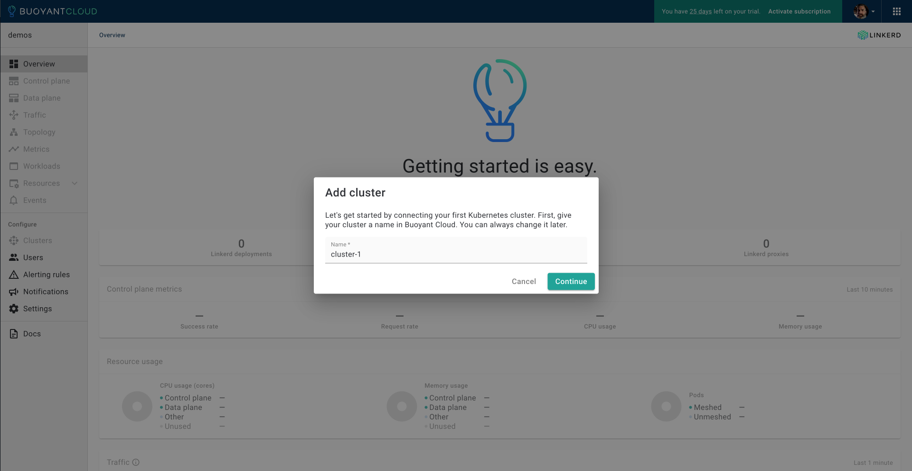
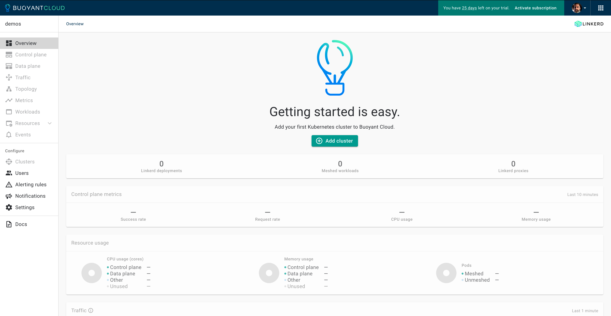
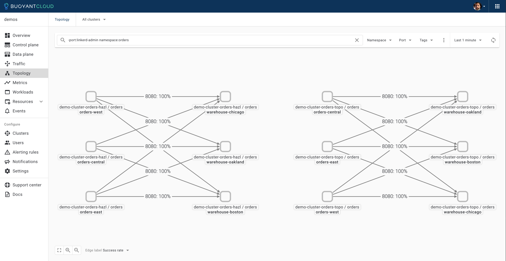
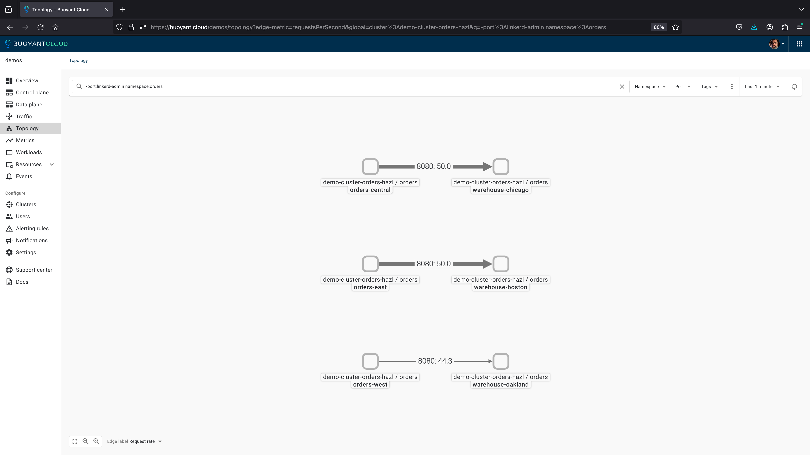
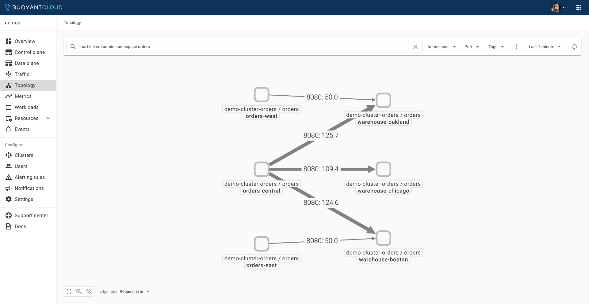

# Eliminating Cross-Zone Kubernetes Traffic With High Availability Zonal Load Balancing (HAZL)

## eliminate-cross-zone-traffic-hazl

### Tom Dean | Buoyant

### Last edit: 3/14/2024

## Introduction

In this _hands-on demonstration_, we will deploy **Buoyant Enterprise for Linkerd** and demonstrate how to enable **High Availability Zonal Load Balancing (HAZL)**. We'll then take a look at how **HAZL** works to keep network traffic _in-zone_ where possible, and compare **HAZL** to **Topology Aware Routing**.

### Buoyant Enterprise for Linkerd (BEL)

[Buoyant Enterprise for Linkerd](https://buoyant.io/enterprise-linkerd)

**Buoyant Enterprise for Linkerd** is an enterprise-grade service mesh for Kubernetes. It makes Kubernetes applications **reliable**, **secure**, and **cost-effective** _without requiring any changes to application code_. Buoyant Enterprise for Linkerd contains all the features of open-source Linkerd, the world's fastest, lightest service mesh, plus _additional_ enterprise-only features such as:

- High Availability Zonal Load Balancing (HAZL)
- Security Policy Generation
- FIPS-140-2/3 Compliance
- Lifecycle Automation
- Enterprise-Hardened Images
- Software Bills of Materials (SBOMs)
- Strict SLAs Around CVE Remediation

We're going to try out **HAZL** in this demo.

### High Availability Zonal Load Balancing (HAZL)

**High Availability Zonal Load Balancing (HAZL)** is a dynamic request-level load balancer in **Buoyant Enterprise for Linkerd** that balances **HTTP** and **gRPC** traffic in environments with **multiple availability zones**. For Kubernetes clusters deployed across multiple zones, **HAZL** can **dramatically reduce cloud spend by minimizing cross-zone traffic**.

Unlike other zone-aware options that use **Topology Hints** (including **Istio** and open source **Linkerd**), **HAZL** _never sacrifices reliability to achieve this cost reduction_.

In **multi-zone** environments, **HAZL** can:

- **Cut cloud spend** by eliminating cross-zone traffic both within and across cluster boundaries;
- **Improve system reliability** by distributing traffic to additional zones as the system comes under stress;
- **Prevent failures before they happen** by quickly reacting to increases in latency before the system begins to fail.
- **Preserve zone affinity for cross-cluster calls**, allowing for cost reduction in multi-cluster environments.

Like **Linkerd** itself, **HAZL** is designed to _"just work"_. It works without operator involvement, can be applied to any Kubernetes service that speaks **HTTP** / **gRPC** regardless of the number of endpoints or distribution of workloads and traffic load across zones, and in the majority of cases _requires no tuning or configuration_.

### How High Availability Zonal Load Balancing (HAZL) Works

For every endpoint, **HAZL** maintains a set of data that includes:

- The **zone** of the endpoint
- The **cost** associated with that zone
- The **recent latency** of responses to that endpoint
- The **recent failure rate** of responses to that endpoint

For every service, **HAZL** continually computes a load metric measuring the utilization of the service. When load to a service falls outside the acceptable range, whether through failures, latency, spikes in traffic, or any other reason, **HAZL** dynamically adds additional endpoints from other zones. When load returns to normal, **HAZL** automatically shrinks the load balancing pool to just in-zone endpoints.

In short: under normal conditions, **HAZL** keeps all traffic within the zone, but when the system is under stress, **HAZL** will temporarily allow cross-zone traffic until the system returns to normal. We'll see this in the **HAZL** demonstration.

**HAZL** will also apply these same principles to cross-cluster / multi-cluster calls: it will preserve zone locality by default, but allow cross-zone traffic if necessary to preserve reliability.

### High Availability Zonal Load Balancing (HAZL) vs Topology Hints

**HAZL** was designed in response to limitations seen by customers using Kubernetes's native **Topology Hints** (aka **Topology-aware Routing**) mechanism. These limitations are shared by native Kubernetes balancing (**kubeproxy**) as well as systems such as open source **Linkerd** and **Istio** that make use of **Topology Hints** to make routing decisions.

Within these systems, the endpoints for each service are allocated ahead of time to specific zones by the **Topology Hints** mechanism. This distribution is done at the Kubernetes API level, and attempts to allocate endpoints within the same zone (but note this behavior isn't guaranteed, and the Topology Hints mechanism may allocate endpoints from other zones). Once this allocation is done, it is static until endpoints are added or removed. It does not take into account traffic volumes, latency, or service health (except indirectly, if failing endpoints get removed via health checks).

Systems that make use of **Topology Hints**, including **Linkerd** and **Istio**, use this allocation to decide where to send traffic. This accomplishes the goal of keeping traffic within a zone but at the expense of reliability: **Topology Hints** itself provides no mechanism for sending traffic across zones if reliability demands it. The closest approximation in (some of) these systems are manual failover controls that allow the operator to failover traffic to a new zone.

Finally, **Topology Hints** has a set of well-known constraints, including:

- It does not work well for services where a large proportion of traffic originates from a subset of zones.
- It does not take into account tolerations, unready nodes, or nodes that are marked as control plane or master nodes.
- It does not work well with autoscaling. The autoscaler may not respond to increases in traffic, or respond by adding endpoints in other zones.
- No affordance is made for cross-cluster traffic.

These constraints have real-world implications. As one customer put it when trying **Istio** + **Topology Hints**: "What we are seeing in _some_ applications is that they won’t scale fast enough or at all (because maybe two or three pods out of 10 are getting the majority of the traffic and is not triggering the HPA) and _can cause a cyclic loop of pods crashing and the service going down_."

### Demonstration: Overview

In this _hands-on demonstration_, we will deploy **Buoyant Enterprise for Linkerd** on a `k3d` Kubernetes cluster and will demonstrate how to quickly enable **High Availability Zonal Load Balancing (HAZL)**. We'll then take a look at how **HAZL** works to keep network traffic _in-zone_ where possible, and explore **Security Policy generation**.

**In this demonstration, we're going to do the following:**

- Deploy two `k3d` Kubernetes clusters
  - One for HAZL
  - One for Topology Aware Routing
- Deploy **Buoyant Enterprise for Linkerd** with **HAZL** disabled on the cluster
- Deploy the **Orders** application to the clusters, to generate multi-zonal traffic
  - Monitor traffic from the **Orders** application, with **HAZL** disabled
- Enable **High Availability Zonal Load Balancing (HAZL)**
  - Monitor traffic from the **Orders** application, with **HAZL** enabled
  - Observe the effect on cross-az traffic
- Increase the number of requests in the **Orders** application
  - Monitor the increased traffic from the **Orders** application
  - Observe the effect on cross-az traffic
- Decrease the number of requests in the **Orders** application
  - Monitor the decreased traffic from the **Orders** application
  - Observe the effect on cross-az traffic

Feel free to follow along with _your own instance_ if you'd like, using the resources and instructions provided in this repository.

### Demo: Prerequisites

**If you'd like to follow along, you're going to need the following:**

- [Docker](https://docs.docker.com/get-docker/)
- [Helm](https://helm.sh/docs/intro/install/)
- [k3d](https://k3d.io)
- [step](https://smallstep.com/docs/step-cli/installation/)
- The `kubectl` command must be installed and working
- The `watch` command must be installed and working, if you want to use it
- The `kubectx` command must be installed and working, if you want to use it
- [Buoyant Enterprise for Linkerd License](https://enterprise.buoyant.io/start_trial)
- [The Demo Assets, from GitHub](https://github.com/BuoyantIO/service-mesh-academy/tree/main/eliminate-cross-zone-traffic-hazl)

All prerequisites must be _installed_ and _working properly_ before proceeding. The instructions in the provided links will get you there. A trial license for Buoyant Enterprise for Linkerd can be obtained from the link above. Instructions on obtaining the demo assets from GitHub are below.

### The Orders Application

This repository includes the **Orders** application, which generates traffic across multiple availability zones in our Kubernetes cluster, allowing us to observe the effect that **High Availability Zonal Load Balancing (HAZL)** has on traffic.

## Demo 1: Deploy a Kubernetes Cluster With Buoyant Enterprise for Linkerd, With HAZL Disabled

First, we'll deploy a Kubernetes cluster using `k3d` and deploy Buoyant Enterprise for Linkerd (BEL).

### Task 1: Clone the `eliminate-cross-zone-traffic-hazl` Assets

[GitHub: Deploying Buoyant Enterprise for Linkerd with High Availability Zonal Load Balancing (HAZL)](https://github.com/BuoyantIO/service-mesh-academy/tree/main/eliminate-cross-zone-traffic-hazl)

To get the resources we will be using in this demonstration, you will need to clone a copy of the GitHub `BuoyantIO/service-mesh-academy` repository. We'll be using the materials in the `service-mesh-academy/eliminate-cross-zone-traffic-hazl` subdirectory.

Clone the `BuoyantIO/service-mesh-academy` GitHub repository to your preferred working directory:

```bash
git clone https://github.com/BuoyantIO/service-mesh-academy.git
```

Change directory to the `eliminate-cross-zone-traffic-hazl` subdirectory in the `service-mesh-academy` repository:

```bash
cd service-mesh-academy/eliminate-cross-zone-traffic-hazl
```

Taking a look at the contents of `service-mesh-academy/eliminate-cross-zone-traffic-hazl`:

```bash
ls -la
```

With the assets in place, we can proceed to creating a cluster with `k3d`.

### Task 2: Deploy two Kubernetes Clusters Using `k3d`

Before we can deploy **Buoyant Enterprise for Linkerd**, we're going to need two Kubernetes clusters. Fortunately, we can use `k3d` for that. There are two cluster configuration files in the `cluster` directory, that will create a cluster with one control plane and three worker nodes, in three different availability zones.

Create the `demo-cluster-orders-hazl` cluster, using the configuration file in `cluster/demo-cluster-orders-hazl.yaml`:

```bash
k3d cluster create -c cluster/demo-cluster-orders-hazl.yaml --wait
```

Create the `demo-cluster-orders-topo` cluster, using the configuration file in `cluster/demo-cluster-orders-topo.yaml`:

```bash
k3d cluster create -c cluster/demo-cluster-orders-topo.yaml --wait
```

Check for our clusters:

```bash
k3d cluster list
```

Checking our contexts:

```bash
kubectx
```

Let's shorten our context names, for ease of use:

```bash
kubectx hazl=k3d-demo-cluster-orders-hazl
kubectx topo=k3d-demo-cluster-orders-topo
```

Finally, we'll switch to the `hazl` context:

```bash
kubectx hazl
```

Checking our contexts again:

```bash
kubectx
```

Now that we have our Kubernetes clusters and contexts up and configured, we can proceed with deploying **Buoyant Enterprise for Linkerd** on them.

### Task 3: Create mTLS Root Certificates

[Generating the certificates with `step`](https://linkerd.io/2.14/tasks/generate-certificates/#generating-the-certificates-with-step)

In order to support **mTLS** connections between _meshed pods_, **Linkerd** needs a **trust anchor certificate** and an **issuer certificate** with its corresponding **key**.

Since we're using **Helm** to install **BEL**, it’s not possible to automatically generate these certificates and keys. We'll need to generate certificates and keys, and we'll use `step`for this.

#### Create Certificates Using `step`

You can generate certificates using a tool like `step`. All certificates must use the ECDSA P-256 algorithm which is the default for `step`. In this section, we’ll walk you through how to to use the `step` CLI to do this.

##### Step 1: Trust Anchor Certificate

To generate your certificates using `step`, use the `certs` directory:

```bash
cd certs
```

Generate the root certificate with its private key (using step):

```bash
step certificate create root.linkerd.cluster.local ca.crt ca.key \
--profile root-ca --no-password --insecure
```

_Note: We use `--no-password` `--insecure` to avoid encrypting those files with a passphrase._

This generates the `ca.crt` and `ca.key` files. The `ca.crt` file is what you need to pass to the `--identity-trust-anchors-file` option when installing **Linkerd** with the CLI, and the `identityTrustAnchorsPEM` value when installing the `linkerd-control-plane` chart with Helm.

For a longer-lived trust anchor certificate, pass the `--not-after` argument to the step command with the desired value (e.g. `--not-after=87600h`).

##### Step 2: Generate Intermediate Certificate and Key Pair

Next, generate the intermediate certificate and key pair that will be used to sign the **Linkerd** proxies’ CSR.

```bash
step certificate create identity.linkerd.cluster.local issuer.crt issuer.key \
--profile intermediate-ca --not-after 8760h --no-password --insecure \
--ca ca.crt --ca-key ca.key
```

This will generate the `issuer.crt` and `issuer.key` files.

Checking our certificates:

```bash
ls -la
```

We should see:

```bash
total 40
drwxr-xr-x  7 tdean  staff  224 Mar  4 18:30 .
drwxr-xr-x  8 tdean  staff  256 Mar  4 18:09 ..
-rw-r--r--  1 tdean  staff   55 Mar  4 17:45 README.md
-rw-------  1 tdean  staff  599 Mar  4 18:29 ca.crt
-rw-------  1 tdean  staff  227 Mar  4 18:29 ca.key
-rw-------  1 tdean  staff  652 Mar  4 18:30 issuer.crt
-rw-------  1 tdean  staff  227 Mar  4 18:30 issuer.key
```

Change back to the parent directory:

```bash
cd ..
```

Now that we have **mTLS** root certificates, we can deploy **BEL**.

### Task 4: Deploy Buoyant Enterprise for Linkerd With HAZL Disabled

[Installation: Buoyant Enterprise for Linkerd](https://docs.buoyant.io/buoyant-enterprise-linkerd/latest/installation/)

Next, we will walk through the process of installing **Buoyant Enterprise for Linkerd**. We're going to start with **HAZL** disabled, and will enable **HAZL** during testing.

#### Step 1: Obtain Buoyant Enterprise for Linkerd (BEL) Trial Credentials and Log In to Buoyant Cloud

If you require credentials for accessing **Buoyant Enterprise for Linkerd**, [sign up here](https://enterprise.buoyant.io/start_trial), and follow the instructions.

You should end up with a set of credentials in environment variables like this:

```bash
export API_CLIENT_ID=[CLIENT_ID]
export API_CLIENT_SECRET=[CLIENT_SECRET]
export BUOYANT_LICENSE=[LICENSE]
```

Add these to a file in the root of the `linkerd-demos/demo-orders` directory, named `settings.sh`, plus add two new lines with the cluster names, `export CLUSTER_NAME=demo-cluster-orders-hazl` and`export CLUSTER_NAME=demo-cluster-orders-topo`, like this:

```bash
export API_CLIENT_ID=[CLIENT_ID]
export API_CLIENT_SECRET=[CLIENT_SECRET]
export BUOYANT_LICENSE=[LICENSE]
export CLUSTER1_NAME=demo-cluster-orders-hazl
export CLUSTER2_NAME=demo-cluster-orders-topo
```

Check the contents of the `settings.sh` file:

```bash
more settings.sh
```

Once you're satisfied with the contents, `source` the file, to load the variables:

```bash
source settings.sh
```

Now that you have a trial login, open an additional browser window or tab, and open **[Buoyant Cloud](https://buoyant.cloud)**. _Log in with the credentials you used for your trial account_.



We'll be adding a cluster during **BEL** installation, so go ahead and click 'Cancel' for now.



You should find yourself in the Buoyant Cloud Overview page. This page provides summary metrics and status data across all your deployments. We'll be working with **Buoyant Cloud** a little more in the coming sections, so we'll set that aside for the moment.

Our credentials have been loaded into environment variables, we're logged into **Buoyant Cloud**, and we can proceed with installing **Buoyant Enterprise Linkerd (BEL)**.

#### Step 2: Download the BEL CLI

We'll be using the **Buoyant Enterprise Linkerd** CLI for many of our operations, so we'll need it _installed and properly configured_.

First, download the **BEL** CLI:

```bash
curl https://enterprise.buoyant.io/install | sh
```

Add the CLI executables to your `$PATH`:

```bash
export PATH=~/.linkerd2/bin:$PATH
```

Let's give the CLI a quick check:

```bash
linkerd version
```

With the CLI installed and working, we can get on with running our pre-installation checks.

#### Step 3: Run Pre-Installation Checks

Use the `linkerd check --pre` command to validate that your clusters are ready for installation.

Check the `hazl` cluster:

```bash
linkerd check --pre --context=hazl
```

Check the `topo` cluster:

```bash
linkerd check --pre --context=topo
```

We should see all green checks.  With everything good and green, we can proceed with installing the **BEL operator**.

#### Step 4: Install BEL Operator Components

[Kubernetes Docs: Operator Pattern](https://kubernetes.io/docs/concepts/extend-kubernetes/operator/)

Next, we'll install the **BEL operator**, which we will use to deploy the **ControlPlane** and **DataPlane** objects.

Add the `linkerd-buoyant` Helm chart, and refresh **Helm** before installing the operator:

```bash
helm repo add linkerd-buoyant https://helm.buoyant.cloud
helm repo update
```

_**INTERNAL:** In order to access the Grafana dashboard in Buoyant Cloud, you'll need to deploy the **BEL operator** with **debug** enabled!_

Deploy the **BEL Operator** to the `hazl` cluster:

```bash
helm install linkerd-buoyant \
  --create-namespace \
  --namespace linkerd-buoyant \
  --kube-context hazl \
  --set metadata.agentName=$CLUSTER1_NAME \
  --set api.clientID=$API_CLIENT_ID \
  --set api.clientSecret=$API_CLIENT_SECRET \
  --set metrics.debugMetrics=true \
  --set agent.logLevel=debug \
  --set metrics.logLevel=debug \
linkerd-buoyant/linkerd-buoyant
```

Deploy the **BEL Operator** to the `topo` cluster:

```bash
helm install linkerd-buoyant \
  --create-namespace \
  --namespace linkerd-buoyant \
  --kube-context topo \
  --set metadata.agentName=$CLUSTER2_NAME \
  --set api.clientID=$API_CLIENT_ID \
  --set api.clientSecret=$API_CLIENT_SECRET \
  --set metrics.debugMetrics=true \
  --set agent.logLevel=debug \
  --set metrics.logLevel=debug \
linkerd-buoyant/linkerd-buoyant
```

After the installs, wait for the `buoyant-cloud-metrics` agents to be ready, then run the post-install operator health checks.

On the `hazl` cluster:

```bash
kubectl rollout status daemonset/buoyant-cloud-metrics -n linkerd-buoyant --context=hazl
linkerd buoyant check --context hazl
```

On the `topo` cluster:

```bash
kubectl rollout status daemonset/buoyant-cloud-metrics -n linkerd-buoyant --context=topo
linkerd buoyant check --context topo
```

We may see a few warnings (!!), but we're good to proceed _as long as the overall status check results are good_.

#### Step 5: Create the Identity Secret

Now we're going to take those **certificates** and **keys** we created using `step`, and use the `ca.crt`, `issuer.crt`, and `issuer.key` to create a Kubernetes Secret that will be used by **Helm** at runtime.

Generate the `linkerd-identity-secret.yaml` manifest:

```bash
cat <<EOF > linkerd-identity-secret.yaml
apiVersion: v1
data:
  ca.crt: $(base64 < certs/ca.crt | tr -d '\n')
  tls.crt: $(base64 < certs/issuer.crt| tr -d '\n')
  tls.key: $(base64 < certs/issuer.key | tr -d '\n')
kind: Secret
metadata:
  name: linkerd-identity-issuer
  namespace: linkerd
type: kubernetes.io/tls
EOF
```

Create the `linkerd-identity-issuer` secret from the `linkerd-identity-secret.yaml` manifest.

On the `hazl` cluster:

```bash
kubectl apply -f linkerd-identity-secret.yaml --context=hazl
```

On the `topo` cluster:

```bash
kubectl apply -f linkerd-identity-secret.yaml --context=topo
```

Let's check the secrets on our cluster.

On the `hazl` cluster:

```bash
kubectl get secrets  -n linkerd --context=hazl
```

On the `topo` cluster:

```bash
kubectl get secrets  -n linkerd --context=topo
```

Now that we have our `linkerd-identity-issuer` secrets, we can proceed with creating the **ControlPlane CRD** configuration manifest.

#### Step 6: Create a ControlPlane Manifest

[Kubernetes Docs: Custom Resources](https://kubernetes.io/docs/concepts/extend-kubernetes/api-extension/custom-resources/)

We deploy the **BEL ControlPlanes** and **DataPlanes** using **Custom Resources**. We'll create a manifest for each that contains the object's configuration. We'll start with the **ControlPlanes** first.

This **CRD configuration** also enables **High Availability Zonal Load Balancing (HAZL)**, using the `- -ext-endpoint-zone-weights` `experimentalArgs`. We're going to omit the `- -ext-endpoint-zone-weights` in the `experimentalArgs` for now, by commenting it out with a `#` in the manifest.

Let's create the ControlPlane manifest for the `hazl` cluster:

```bash
cat <<EOF > linkerd-control-plane-config-hazl.yaml
apiVersion: linkerd.buoyant.io/v1alpha1
kind: ControlPlane
metadata:
  name: linkerd-control-plane
spec:
  components:
    linkerd:
      version: enterprise-2.15.1-1
      license: $BUOYANT_LICENSE
      controlPlaneConfig:
        proxy:
          image:
            version: enterprise-2.15.1-1-hazl
        identityTrustAnchorsPEM: |
$(sed 's/^/          /' < certs/ca.crt )
        identity:
          issuer:
            scheme: kubernetes.io/tls
        destinationController:
          additionalArgs:
           # - -ext-endpoint-zone-weights
EOF
```

Next, we'll create the ControlPlane manifest for the `topo` cluster:

```bash
cat <<EOF > linkerd-control-plane-config-topo.yaml
apiVersion: linkerd.buoyant.io/v1alpha1
kind: ControlPlane
metadata:
  name: linkerd-control-plane
spec:
  components:
    linkerd:
      version: enterprise-2.15.1-1
      license: $BUOYANT_LICENSE
      controlPlaneConfig:
        proxy:
          image:
            version: enterprise-2.15.1-1
        identityTrustAnchorsPEM: |
$(sed 's/^/          /' < certs/ca.crt )
        identity:
          issuer:
            scheme: kubernetes.io/tls
EOF
```

Apply the ControlPlane CRD configurations to have the Linkerd BEL operator create the **ControlPlanes**.

On the `hazl` cluster:

```bash
kubectl apply -f linkerd-control-plane-config-hazl.yaml --context=hazl
```

On the `topo` cluster:

```bash
kubectl apply -f linkerd-control-plane-config-topo.yaml --context=topo
```

To make adjustments to your **BEL ControlPlane** deployment _simply edit and re-apply the `linkerd-control-plane-config-*.yaml` manifest_.

#### Step 7: Verify the ControlPlane Installation

After the installation is complete, watch the deployment of the Control Plane using `kubectl`.

On the `hazl` cluster:

```bash
watch -n 1 kubectl get pods -A -o wide --sort-by .metadata.namespace --context=hazl
```

On the `topo` cluster:

```bash
watch -n 1 kubectl get pods -A -o wide --sort-by .metadata.namespace --context=topo
```

**_Use `CTRL-C` to exit the watch command._**

Let's can verify the health and configuration of Linkerd by running the `linkerd check` command.

On the `hazl` cluster:

```bash
linkerd check --context hazl
```

On the `topo` cluster:

```bash
linkerd check --context topo
```

Again, we may see a few warnings (!!), but we're good to proceed _as long as the overall status is good_.

#### Step 8: Create the DataPlane Objects for `linkerd-buoyant`

Now, we can deploy the **DataPlane** for the `linkerd-buoyant` namespace. Let's create the **DataPlane** manifest:

```bash
cat <<EOF > linkerd-data-plane-config.yaml
---
apiVersion: linkerd.buoyant.io/v1alpha1
kind: DataPlane
metadata:
  name: linkerd-buoyant
  namespace: linkerd-buoyant
spec:
  workloadSelector:
    matchLabels: {}
EOF
```

Apply the **DataPlane CRD configuration** manifest to have the **BEL operator** create the **DataPlane**.

On the `hazl` cluster:

```bash
kubectl apply -f linkerd-data-plane-config.yaml --context=hazl
```

On the `topo` cluster:

```bash
kubectl apply -f linkerd-data-plane-config.yaml --context=topo
```

#### Step 9: Monitor Buoyant Cloud Metrics Rollout and Check Proxies

Now that both our **BEL ControlPlane** and **DataPlane** have been deployed, we'll check the status of our `buoyant-cloud-metrics` daemonset rollout.

On the `hazl` cluster:

```bash
kubectl rollout status daemonset/buoyant-cloud-metrics -n linkerd-buoyant --context=hazl
```

On the `topo` cluster:

```bash
kubectl rollout status daemonset/buoyant-cloud-metrics -n linkerd-buoyant --context=topo
```

Once the rollout is complete, we'll use `linkerd check --proxy` command to check the status of our **BEL** proxies.

On the `hazl` cluster:

```bash
linkerd check --proxy -n linkerd-buoyant --context hazl
```

On the `topo` cluster:

```bash
linkerd check --proxy -n linkerd-buoyant --context topo
```

Again, we may see a few warnings (!!), _but we're good to proceed as long as the overall status is good_.

We've successfully installed **Buoyant Enterprise for Linkerd**, and can now use **BEL** to manage and secure our Kubernetes applications.

## Demo 2: Observe the Effects of High Availability Zonal Load Balancing (HAZL)

### Deploy the Orders Application

Now that **BEL** is fully deployed, we're going to need some traffic to observe.

Deploy the **Orders** application, from the `orders` directory for the `hazl` cluster, and from the `orders-topo` directory for the `topo` cluster.  The `orders-topo` application is the same as the `orders` application, but is configured for Topology Aware Routing.

On the `hazl` cluster, deploy from the `orders` directory:

```bash
kubectl apply -k orders --context=hazl
```

On the `topo` cluster, deploy from the `orders-topo` directory:

```bash
kubectl apply -k orders-topo --context=topo
```

We can check the status of the **Orders** application by watching the rollout.

On the `hazl` cluster:

```bash
watch -n 1 kubectl get pods -n orders -o wide --sort-by .spec.nodeName --context=hazl
```

On the `topo` cluster:

```bash
watch -n 1 kubectl get pods -n orders -o wide --sort-by .spec.nodeName --context=topo
```

**_Use `CTRL-C` to exit the watch command._**

### Create a DataPlane Object for the `orders` Namespace

Let's create the **DataPlane** manifest for the `orders` namespace:

```bash
cat <<EOF > linkerd-data-plane-orders-config.yaml
---
apiVersion: linkerd.buoyant.io/v1alpha1
kind: DataPlane
metadata:
  name: linkerd-orders
  namespace: orders
spec:
  workloadSelector:
    matchLabels: {}
EOF
```

Apply the **DataPlane CRD configuration** manifest to have the **BEL operator** create the **DataPlane** object for the `orders` namespace.

On the `hazl` cluster:

```bash
kubectl apply -f linkerd-data-plane-orders-config.yaml --context=hazl
```

On the `topo` cluster:

```bash
kubectl apply -f linkerd-data-plane-orders-config.yaml --context=topo
```

With the **Orders** application deployed, we now have some traffic to work with.

### Monitor Traffic Without HAZL Enabled and Topology Aware Routing

Let's take a look at traffic flow _without **HAZL** enabled_ in **Buoyant Cloud**. This will give us a more visual representation of our baseline traffic. Head over to **Buoyant Cloud**, and take a look at the contents of the `orders` namespace in the Topology tab.



We can see...

### Enable High Availability Zonal Load Balancing (HAZL)

Let's take a look at how quick and easy we can enable **High Availability Zonal Load Balancing (HAZL)**.

Remember, to make adjustments to your **BEL** deployment _simply edit and re-apply the previously-created `linkerd-control-plane-config-hazl.yaml` manifest_. We're going to **enable** the `- -ext-endpoint-zone-weights` in the `experimentalArgs` for now, by uncommenting it in the manifest:

Edit the `linkerd-control-plane-config-hazl.yaml` file:

```bash
vi linkerd-control-plane-config-hazl.yaml
```

Apply the ControlPlane CRD config to have the Linkerd BEL operator update the Linkerd control plane configuration, and enable HAZL _on the `hazl` cluster only_:

```bash
kubectl apply -f linkerd-control-plane-config-hazl.yaml --context=hazl
```

Now, we can see the effect **HAZL** has on the traffic in our multi-az cluster.

### Monitor Traffic With HAZL Enabled

Let's take a look at what traffic looks like with **HAZL** enabled, using **Buoyant Cloud**. This will give us a more visual representation of the effect of **HAZL** on our traffic.



We can see...

### Increase Number of Requests From the `orders-central` Requestor

General instructions on how to turn up requests

Scale the `orders-central` Deployment to 15 replicas on both clusters:

```bash
kubectl scale deploy orders-central -n orders --replicas=15 --context=hazl ; kubectl scale deploy orders-central -n orders --replicas=15 --context=topo
```

Give things a minute to develop, then head over to **Buoyant Cloud**.

### Monitor Traffic Using Buoyant Cloud

Let's take a look at what the increased traffic looks like in **Buoyant Cloud**. This will give us a more visual representation of the effect of **HAZL** on our traffic.


We can see...

<<Explain what we're seeing here>>

### Decrease Number of Requests From the `orders-central` Requestor

General instructions on how to turn down requests

Scale the `orders-central` Deployment to 11 replica on both clusters:

```bash
kubectl scale deploy orders-central -n orders --replicas=1 --context=hazl ; kubectl scale deploy orders-central -n orders --replicas=1 --context=topo
```

Give things a minute to develop, then head over to **Buoyant Cloud**.

### Monitor Traffic Using Buoyant Cloud

Let's take a look at what the increased traffic looks like in **Buoyant Cloud**. This will give us a more visual representation of the effect of **HAZL** on our traffic.


We can see...

<<Explain what we're seeing here>>

### Increase Number of Requests From the `orders-west` Requestor

General instructions on how to turn up requests

Scale the `orders-west` Deployment to 25 replicas on both clusters:

```bash
kubectl scale deploy orders-west -n orders --replicas=25 --context=hazl ; kubectl scale deploy orders-west -n orders --replicas=25 --context=topo
```

Give things a minute to develop, then head over to **Buoyant Cloud**.

### Monitor Traffic Using Buoyant Cloud

Let's take a look at what the increased traffic looks like in **Buoyant Cloud**. This will give us a more visual representation of the effect of **HAZL** on our traffic.


We can see...

<<Explain what we're seeing here>>

### Kill the `warehouse-oakland` Workload

General instructions on how to turn up requests

Scale the `warehouse-oakland` Deployment to 0 replicas on both clusters:

```bash
kubectl scale deploy warehouse-oakland -n orders --replicas=0 --context=hazl ; kubectl scale deploy warehouse-oakland -n orders --replicas=0 --context=topo
```

Give things a minute to develop, then head over to **Buoyant Cloud**.

### Monitor Traffic Using Buoyant Cloud

Let's take a look at what the increased traffic looks like in **Buoyant Cloud**. This will give us a more visual representation of the effect of **HAZL** on our traffic.


We can see...

<<Explain what we're seeing here>>

### Restore the `warehouse-oakland` Workload

General instructions

Scale the `warehouse-oakland` Deployment to 1 replica on both clusters:

```bash
kubectl scale deploy warehouse-oakland -n orders --replicas=0 --context=hazl ; kubectl scale deploy warehouse-oakland -n orders --replicas=0 --context=topo
```

Give things a minute to develop, then head over to **Buoyant Cloud**.

### Monitor Traffic Using Buoyant Cloud

Let's take a look at what the increased traffic looks like in **Buoyant Cloud**. This will give us a more visual representation of the effect of **HAZL** on our traffic.


We can see...

<<Explain what we're seeing here>>

### Reset the Orders Application to the Initial State on Both Clusters

General instructions

Re-apply the initial configuration of the `orders` application on both clusters:

```bash
kubectl apply -k orders --context=hazl ; kubectl apply -k orders-topo --context=topo
```

Give things a minute to develop, then head over to **Buoyant Cloud**.

### Monitor Traffic Using Buoyant Cloud

Let's take a look at what the increased traffic looks like in **Buoyant Cloud**. This will give us a more visual representation of the effect of **HAZL** on our traffic.



We can see...

<<Explain what we're seeing here>>

## Summary: Deploying the Orders Application With High Availability Zonal Load Balancing (HAZL)

<<Summarize the entire thing here. Bullet points?>>
