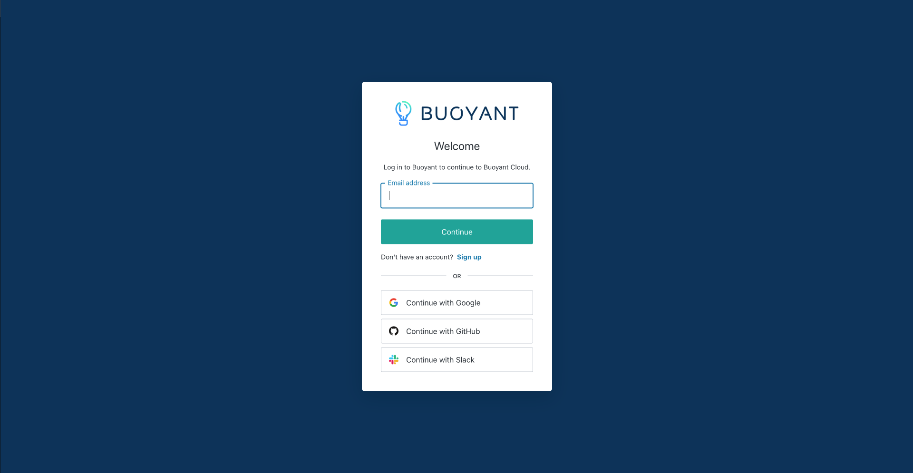
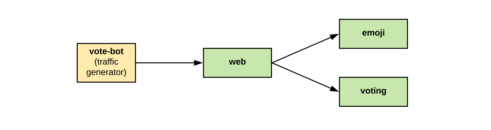

# Introduction to Service Mesh and Linkerd

## intro-to-service-mesh-linkerd

### Tom Dean | Jason Morgan | Buoyant

### Last edit: 2/12/2024

## Introduction

In this _hands-on demonstration_, we will...

**Agenda:**

- Introductions
- What is a Service Mesh?
- What is Linkerd?
- Introduction to Buoyant Cloud
- Hands-On Demonstration

## Demonstration: Overview

Let's take a high-level look at what we're doing in this demonstration.

**Demonstration Workflow:**

- Preparation Steps
  - Create a Cluster with `k3d`
  - Install the Emojivoto Application
  - Connect to the Emojivoto Web Service With a Browser
  - Login to Buoyant Cloud
  - Obtain Buoyant Enterprise for Linkerd (BEL) Trial Credentials and Set Environment Variables

- Start Demonstration
  - Background Information: Slides
  - Introduction to the Emojivoto Application
    - Show how it works

- Install Buoyant Enterprise for Linkerd (BEL)
  - Install the Buoyant Enterprise for Linkerd (BEL) CLI
  - Run pre-installation checks
  - Deploy Cert-Manager On Our Cluster
  - Configuring Cert-Manager As an On-Cluster CA
  - Deploy the BEL Operator
  - Deploy the BEL ControlPlane
  - Deploy the BEL DataPlane
  - Verify the Linkerd DataPlane Installation
  - Monitor Buoyant Cloud Metrics Rollout and Check Proxies

- Annotate the Emojivoto Application
  - Use the `linkerd` command to annotate the `emojivoto` namespace
- Restart DataPlane Rollout for the `emojivoto` Namespace
  - Watch pods redeploy
  - See workloads are meshed
- Explore the Emojivoto Application Using Web Browser
  - Show that it works after deploying Linkerd
- Explore Cluster Using Buoyant Cloud

## Preparation Steps

Before we can start the demonstration, we'll need a few things.

### Create a Cluster with `k3d`

Create the `demo-cluster` cluster, using the configuration file in `cluster/demo-cluster.yaml`:

```bash
k3d cluster create -c cluster/demo-cluster.yaml --wait
```

### Install the Emojivoto Application

We're going to install the Emojivoto application to have a workload on our `demo-cluster`:

```bash
curl -s https://run.linkerd.io/emojivoto.yml -L | kubectl apply -f -
```

Monitor the Emojivoto application to make sure it rolled out correctly:

```bash
watch -n 1 kubectl get all -n emojivoto -o wide
```

**_Use `CTRL-C` to exit the watch command._**

Port-forward the Emojivoto application:

```bash
kubectl port-forward service/web-svc -n emojivoto 8080:80 &
```

Open the Emojivoto dashboard in the browser on `http://localhost:8080`.


*The main page of the Emojivoto application.*

Confirm things are working. Vote, refresh the dashboard, etc. Return to the main page of the Emojivoto application.

### Login to Buoyant Cloud

To get credentials for accessing **Buoyant Enterprise for Linkerd**, [sign up here](https://enterprise.buoyant.io/start_trial), and follow the instructions.

If you're not already logged in, log in to Buoyant Cloud



This will take you to the Overview page, where you will be asked to create a cluster.  Click 'Cancel' for now.


Now that we're logged in to Buoyant Cloud, we can obtain our trial credentials.

### Obtain Buoyant Enterprise for Linkerd (BEL) Trial Credentials and Set Environment Variables

If you go [here](https://enterprise.buoyant.io/), you should end up with a set of credentials in environment variables like this:

```bash
export API_CLIENT_ID=[CLIENT_ID]
export API_CLIENT_SECRET=[CLIENT_SECRET]
export BUOYANT_LICENSE=[LICENSE]
```

Add these to a file in the root of the repository you checked out, named `settings.sh`, plus add a new line with the cluster name, `export CLUSTER_NAME=demo-cluster`, like this:

```bash
export API_CLIENT_ID=[CLIENT_ID]
export API_CLIENT_SECRET=[CLIENT_SECRET]
export BUOYANT_LICENSE=[LICENSE]
export CLUSTER_NAME=demo-cluster
```

Check the contents of the `settings.sh` file:

```bash
more settings.sh
```

Once you're satisfied with the contents, `source` the file, to load the variables:

```bash
source settings.sh
```

**_You're ready to start the demonstration!_**

## Demonstration: Getting Started

Let's kick off our session on Introduction to Service Mesh and Linkerd!

### Background Information: Slides

Before we get hands-on, we're going to cover some background information in a few [slides](https://docs.google.com/presentation/d/1jiv6ocwsAb-oG1QfCr3R-sleCpmfdj5Si68g0T7xC2E/edit?usp=sharing).

### Introduction to the Emojivoto Application

[GitHub: Emoji.voto](https://github.com/BuoyantIO/emojivoto)

"Emojivoto is a microservice application that allows users to vote for their favorite emoji, and tracks votes received on a leaderboard. May the best emoji win!"

**The application is composed of the following 3 services:**

- **emojivoto-web**: Web frontend and REST API
- **emojivoto-emoji-svc**: gRPC API for finding and listing emoji
- **emojivoto-voting-svc**: gRPC API for voting and leaderboard



**_Let's head over to the web browser and take a look at how Emojivoto works!_**

## Explore the Emojivoto Application Using Web Browser

**_Let's examine the Emojivoto application!_**


*The main page of the Emojivoto application.*


*This page shows your vote and allows you to either vote again or return to the leaderboard.*


*The Emojivoto leaderboard page.*

Let's return to the Emojivoto main page before moving on to BEL installation.

## Installing Buoyant Enterprise for Linkerd (BEL)

Now, we're going to deploy Buoyant Enterprise for Linkerd (BEL) on our cluster, along with Cert-Manager to manage our mTLS certificates.

**Overview:**

- Install the Buoyant Enterprise for Linkerd (BEL) CLI
- Run pre-installation checks
- Deploy Cert-Manager On Our Cluster
- Configuring Cert-manager As an On-Cluster CA
- Deploy the BEL Operator
- Deploy the BEL ControlPlane
- Deploy the BEL DataPlane
- Verify the Linkerd DataPlane Installation
- Monitor Buoyant Cloud Metrics Rollout and Check Proxies

### Install the Buoyant Enterprise for Linkerd (BEL) CLI

We'll be using the **Buoyant Enterprise for Linkerd** CLI for many of our operations, so we'll need it _installed and properly configured_.

First, download the **BEL** CLI:

```bash
curl -sL https://enterprise.buoyant.io/install-preview | sh
```

Add the CLI executables to your `$PATH`:

```bash
export PATH=~/.linkerd2/bin:$PATH
```

Let's give the CLI a quick check:

```bash
linkerd version
```

With the CLI installed and working, we can get on with running our pre-installation checks.

### Pre-Installation Checks

Before we install the Linkerd operator, we're going to use the `linkerd check --pre` command to validate that our cluster is ready for installation:

```bash
linkerd check --pre
```

We should see all green checks. If this is the case, we can proceed.

### Why Use Cert-manager?

[linkerd.io: Cert manager as an on-cluster CA](https://linkerd.io/2.14/tasks/automatically-rotating-control-plane-tls-credentials/)

Linkerd’s automatic mTLS feature generates TLS certificates for proxies and automatically rotates them without user intervention. These certificates are derived from a trust anchor, which is shared across clusters, and an issuer certificate, which is specific to the cluster.

While Linkerd automatically rotates the per-proxy TLS certificates, it does not rotate the issuer certificate. In this section, we’ll describe how to set up automatic rotation of the issuer certificate and its corresponding private key using the cert-manager project.

### Deploy Cert-Manager On Our Cluster

[Cert-manager: Installation](https://cert-manager.io/docs/installation/)

Before we can configure Cert-Manager to work with Linkerd, we'll need to install it:

```bash
kubectl apply -f https://github.com/cert-manager/cert-manager/releases/download/v1.14.1/cert-manager.yaml
```

Let's confirm the installation was successful:

```bash
watch -n 1 kubectl get all -n cert-manager
```

**_Use `CTRL-C` to exit the watch command._**

Now that Cert-manager is installed, we can move forward with configuring it.

### Configuring Cert-Manager As an On-Cluster CA

First, create the namespace that Cert-Manager will use to store its Linkerd-related resources. For simplicity, we suggest reusing the default Linkerd control plane namespace:

```bash
kubectl create namespace linkerd
```

Next, using the step tool, create a signing key pair and store it in a Kubernetes Secret in the `linkerd` namespace:

```bash
step certificate create root.linkerd.cluster.local certs/ca.crt certs/ca.key \
  --profile root-ca --no-password --insecure &&
  kubectl create secret tls \
    linkerd-trust-anchor \
    --cert=certs/ca.crt \
    --key=certs/ca.key \
    --namespace=linkerd
```

Checking for our new Secret:

```bash
kubectl get secrets -A
```

With the Secret in place, we can create a cert-manager “Issuer” resource that references it:

```bash
cat <<EOF > linkerd-trust-anchor.yaml
apiVersion: cert-manager.io/v1
kind: Issuer
metadata:
  name: linkerd-trust-anchor
  namespace: linkerd
spec:
  ca:
    secretName: linkerd-trust-anchor
EOF
```

Examining the `linkerd-trust-anchor` manifest:

```bash
cat linkerd-trust-anchor.yaml
```

Applying the `linkerd-trust-anchor` manifest:

```bash
kubectl apply -f linkerd-trust-anchor.yaml
```

Checking the Issuer we just created:

```bash
kubectl get issuer.cert-manager.io -n linkerd
```

Finally, we can create a cert-manager “Certificate” resource which uses this Issuer to generate the desired certificate:

```bash
cat <<EOF > linkerd-identity-issuer.yaml
apiVersion: cert-manager.io/v1
kind: Certificate
metadata:
  name: linkerd-identity-issuer
  namespace: linkerd
spec:
  secretName: linkerd-identity-issuer
  duration: 48h
  renewBefore: 25h
  issuerRef:
    name: linkerd-trust-anchor
    kind: Issuer
  commonName: identity.linkerd.cluster.local
  dnsNames:
  - identity.linkerd.cluster.local
  isCA: true
  privateKey:
    algorithm: ECDSA
  usages:
  - cert sign
  - crl sign
  - server auth
  - client auth
EOF
```

Examining the `linkerd-identity-issuer` manifest:

```bash
cat linkerd-identity-issuer.yaml
```

*In the YAML manifest above, the duration key instructs cert-manager to consider certificates as valid for 48 hours and the renewBefore key indicates that cert-manager will attempt to issue a new certificate 25 hours before expiration of the current one. These values can be customized to your liking.*

Applying the `linkerd-identity-issuer` manifest:

```bash
kubectl apply -f linkerd-identity-issuer.yaml
```

Checking our Certificate:

```bash
kubectl get certificate.cert-manager.io -n linkerd
```

At this point, cert-manager can now use this Certificate resource to obtain TLS credentials, which will be stored in a secret named linkerd-identity-issuer.

Once more, checking everything we've just done:

```bash
kubectl get secrets,issuer.cert-manager.io,certificate.cert-manager.io -n linkerd
```

To validate your newly-issued certificate, you can run:

```bash
kubectl get secret linkerd-identity-issuer -o yaml -n linkerd
```

Now that we've configured automatic rotation of Linkerd’s control plane mTLS credentials, we can move on to deploying the Linkerd operator.

### Deploy the Linkerd Operator

[Kubernetes Docs: Operator Pattern](https://kubernetes.io/docs/concepts/extend-kubernetes/operator/)

Next, we'll install the **Linkerd operator**, which we will use to deploy the **ControlPlane** and **DataPlane** objects.  In addition, the operator will deploy the Buoyant Cloud agent.

Add the `linkerd-buoyant` Helm chart, and refresh **Helm** before installing the operator:

```bash
helm repo add linkerd-buoyant https://helm.buoyant.cloud
helm repo update
```

Now, we can install the **BEL operator** itself:

```bash
helm install linkerd-buoyant \
  --create-namespace \
  --namespace linkerd-buoyant \
  --set metadata.agentName=demo-cluster \
  --set api.clientID=$API_CLIENT_ID \
  --set api.clientSecret=$API_CLIENT_SECRET \
linkerd-buoyant/linkerd-buoyant
```

After the install, wait for the `buoyant-cloud-metrics` agent to be ready, then run the post-install operator health checks:

```bash
kubectl rollout status daemonset/buoyant-cloud-metrics -n linkerd-buoyant
linkerd buoyant check
```

We may see a few warnings (!!), but we're good to proceed _as long as the overall status check results are good_.

### Deploy the Linkerd ControlPlane and DataPlane Objects

Next, we'll use the Linkerd operator to deploy the ControlPlane.

**Overview:**

- Create a ControlPlane Manifest
- Deploy the Linkerd ControlPlane Using the Manifest
- Verify the Linkerd ControlPlane Installation
- Create a DataPlane Manifest
- Deploy the Linkerd DataPlane Using the Manifest
- Verify the Linkerd DataPlane Installation
- Monitor Buoyant Cloud Metrics Rollout and Check Proxies

#### Create a ControlPlane Manifest

[Kubernetes Docs: Custom Resources](https://kubernetes.io/docs/concepts/extend-kubernetes/api-extension/custom-resources/)

We deploy the **BEL ControlPlane** and **DataPlane** using **Custom Resources**. We'll create a manifest for each that contains their configuration. We'll start with the **ControlPlane** first.

Let's create the ControlPlane manifest:

```bash
cat <<EOF > linkerd-control-plane-config.yaml
apiVersion: linkerd.buoyant.io/v1alpha1
kind: ControlPlane
metadata:
  name: linkerd-control-plane
spec:
  components:
    linkerd:
      version: preview-24.2.2
      license: $BUOYANT_LICENSE
      controlPlaneConfig:
        proxy:
          image:
            version: preview-24.2.2-hazl
        identityTrustAnchorsPEM: |
$(sed 's/^/          /' < certs/ca.crt )
        identity:
          issuer:
            scheme: kubernetes.io/tls
        destinationController:
          experimentalArgs:
          # - -experimental-endpoint-zone-weights
        nodeAffinity:
          requiredDuringSchedulingIgnoredDuringExecution:
            nodeSelectorTerms:
            - matchExpressions:
              - key: topology.kubernetes.io/zone
                operator: DoesNotExist
EOF
```

Examining the `linkerd-control-plane-config` manifest we just created:

```bash
cat linkerd-control-plane-config.yaml
```

The manifest for the Custom Resource Definition for the Control Plane is pretty straightforward...

#### Deploy the Linkerd ControlPlane Using the Manifest

Apply the ControlPlane CRD config to have the Linkerd BEL operator create the ControlPlane:

```bash
kubectl apply -f linkerd-control-plane-config.yaml
```

#### Verify the Linkerd ControlPlane Installation

After the installation is complete, watch the deployment of the Control Plane using `kubectl`:

```bash
watch -n 1 kubectl get pods -A -o wide --sort-by .metadata.namespace
```

**_Use `CTRL-C` to exit the watch command._**

Let's can verify the health and configuration of Linkerd by running the `linkerd check` command:

```bash
linkerd check
```

Again, we may see a few warnings (!!), but we're good to proceed _as long as the overall status is good_.

To make adjustments to your **BEL ControlPlane** deployment _simply edit and re-apply the `linkerd-control-plane-config.yaml` manifest_.

#### Create a DataPlane Manifest

Now, we can deploy the **DataPlane**. Let's create the **DataPlane** manifest for the `linkerd-buoyant` namespace:

```bash
cat <<EOF > linkerd-data-plane-config.yaml
---
apiVersion: linkerd.buoyant.io/v1alpha1
kind: DataPlane
metadata:
  name: linkerd-buoyant
  namespace: linkerd-buoyant
spec:
  workloadSelector:
    matchLabels: {}
EOF
```

Examining the `linkerd-data-plane-config` manifest we just created:

```bash
cat linkerd-data-plane-config.yaml
```

We can see that this will deploy a Data Plane in the `linkerd-buoyant` namespace and will inject all workloads in that namespace.

#### Deploy the Linkerd DataPlane Using the Manifest

Apply the **DataPlane CRD configuration** manifest to have the **BEL operator** create the **DataPlane**:

```bash
kubectl apply -f linkerd-data-plane-config.yaml
```

#### Verify the Linkerd DataPlane Installation

Let's can verify the health and configuration of Linkerd by running the `linkerd check` command:

```bash
linkerd check
```

#### Monitor Buoyant Cloud Metrics Rollout and Check Proxies

Now that both our **BEL ControlPlane** and **DataPlane** have been deployed, we'll check the status of our `buoyant-cloud-metrics` Daemonset rollout:

```bash
kubectl rollout status daemonset/buoyant-cloud-metrics -n linkerd-buoyant
```

Once the rollout is complete, we'll use `linkerd check --proxy` command to check the status of our **BEL** proxies:

```bash
linkerd check --proxy
```

Again, we may see a few warnings (!!), _but we're good to proceed as long as the overall status is good_.

We've successfully installed **Buoyant Enterprise for Linkerd**, and can now use **BEL** to manage and secure our Kubernetes applications.

## Buoyant Cloud Tour: Examine Our Cluster


<<Explain what we're seeing here>>


<<Explain what we're seeing here>>


<<Explain what we're seeing here>>


<<Explain what we're seeing here>>


<<Explain what we're seeing here>>


<<Explain what we're seeing here>>


<<Explain what we're seeing here>>


<<Explain what we're seeing here>>


<<Explain what we're seeing here>>


<<Explain what we're seeing here>>


<<Explain what we're seeing here>>


<<Explain what we're seeing here>>


<<Explain what we're seeing here>>

*Now that we've take a quick tour of Buoyant Cloud, let's see how we can add our Emojivoto application to our Service Mesh.*

## Annotate the Emojivoto Application

[linkerd.io: Adding your services to Linkerd](https://linkerd.io/2.14/tasks/adding-your-service/)

[linkerd.io: inject](https://linkerd.io/2.14/reference/cli/inject/#)

In order to add Emojivoto to the service mesh, we'll first add an annotation to the `emojivoto` namespace.

Use `linkerd inject` to annotate the `emojivoto` namespace:

```bash
kubectl get ns/emojivoto -o yaml | linkerd inject - | kubectl apply -f -
```

Checking our work:

```bash
kubectl get ns/emojivoto -o yaml | grep inject:
```

We can see the annotation we just added to the `emojivoto` namespace.

Let's create the **DataPlane** manifest for the `emojivoto` namespace:

```bash
cat <<EOF > linkerd-data-plane-config-emojivoto.yaml
---
apiVersion: linkerd.buoyant.io/v1alpha1
kind: DataPlane
metadata:
  name: emojivoto-dataplane
  namespace: emojivoto
spec:
  workloadSelector:
    matchLabels: {}
EOF
```

Examining the `linkerd-data-plane-config-emojivoto` manifest we just created:

```bash
cat linkerd-data-plane-config-emojivoto.yaml
```

We can see that this will deploy a Data Plane in the `emojivoto` namespace and will inject all workloads in that namespace.

Apply the **DataPlane CRD configuration** manifest to have the **BEL operator** create the **DataPlane**:

```bash
kubectl apply -f linkerd-data-plane-config.yaml
```

Let's head over to Buoyant Cloud and check our Emojivoto workloads to see them join the mesh!

## Examine Emojivoto in Buoyant Cloud


<<Explain what we're seeing here>>


<<Explain what we're seeing here>>


<<Explain what we're seeing here>>


<<Explain what we're seeing here>>

## Check DataPlane Rollout for the Emojivoto Namespace

<<Quick summary of what we're going to do>>

Checking the status of the Linkerd proxies in the `emojivoto` namespace:

```bash
linkerd check --proxy --namespace emojivoto
```

<<Quick summary of what we just did>>

Monitor the Emojivoto application to make sure it rolled out correctly:

```bash
watch -n 1 kubectl get all -n emojivoto -o wide
```

**_Use `CTRL-C` to exit the watch command._**

<<Quick summary of what we just did>>

## Explore the Emojivoto Application Using Web Browser

*Now that our Emojivoto application is part of the Service Mesh, let's head back and examine the Emojivoto application!*

We'll need to re-forward port 80, as we've rotated our workloads:

```bash
kubectl port-forward service/web-svc -n emojivoto 8080:80 &
```

Now we can reconnect via our web browser to `http://localhost:8080`.


*The main page of the Emojivoto application.*


*This page shows your vote and allows you to either vote again or return to the leaderboard.*


*The Emojivoto leaderboard page.*

We can see that our application is up and still servicing requests.

## Summary: Introduction to the Service Mesh and Linkerd

<<Head back to the last slide>>

Let’s go ahead and wrap up what we’ve covered:

**What is a Service Mesh?**
- Userspace proxies, "next” to services, the data plane
- Set of management processes, the control plane
- Provides security, observability, and reliability features at a platform level

**What is Linkerd?**
- Ultralight, ultrafast, security-first open source service mesh for Kubernetes
- Also the first service mesh to achieve CNCF graduation status
- BEL has everything in OSS Linkerd plus features including
  - HAZL
  - FIPS
  - Security Policy management
  - Mesh Expansion

**Introduction to Buoyant Cloud**
  - Automated Monitoring of Linkerd
  - Comprehensive platform-wide dashboard

**Demonstration**
- Hands-on with BEL
- Took a tour of Buoyant Cloud

**_Thank you for taking the time to explore the Service Mesh, and Linkerd, with us today!_**
